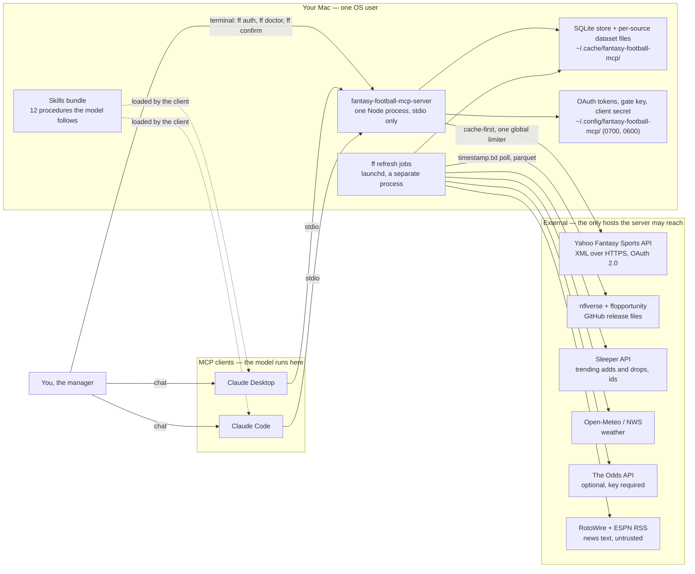
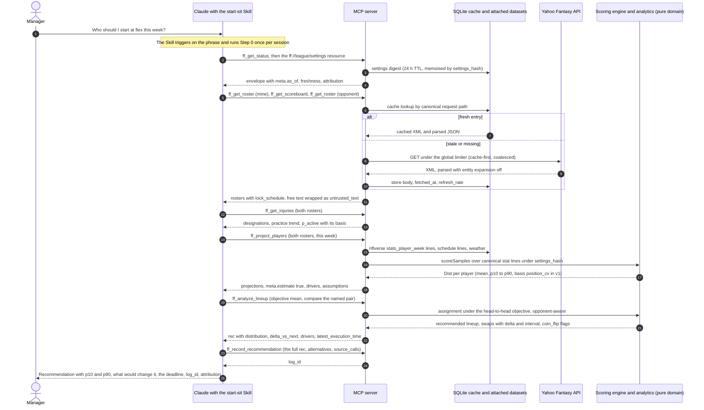
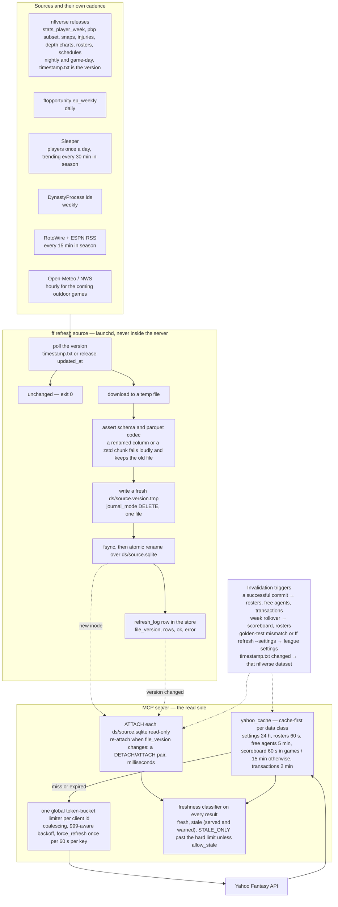
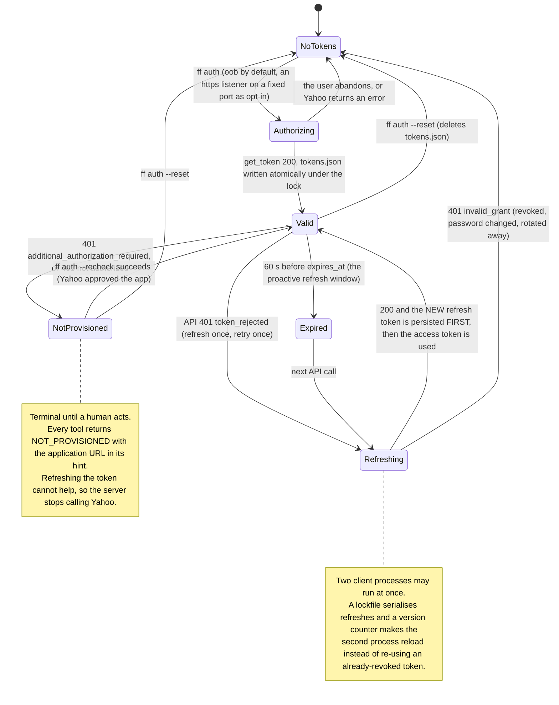
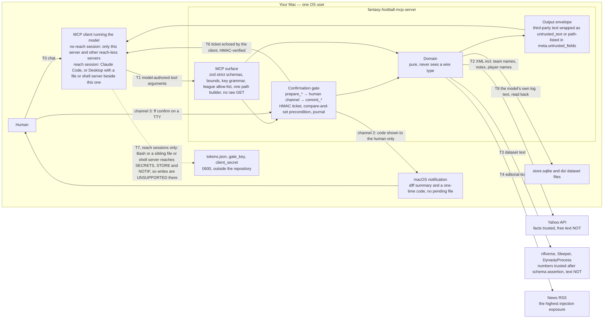
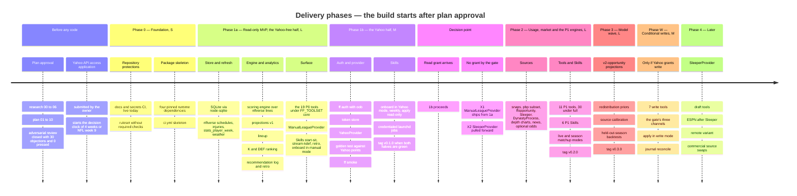

<h1 align="center">🏈 Yahoo Fantasy Football MCP Server</h1>

<strong>Format-aware, deeply reasoned fantasy-football recommendations for Claude — read-only first, a human confirms every write, and news is data, never instructions.</strong>

  
  
  
  = 24.15" src="https://img.shields.io/badge/node-%3E%3D24.15-339933?logo=node.js&logoColor=white">
  
  
  
  

> **This is a plan, not a release.** Every feature on this page is **📋 planned**. No server code exists yet; the build starts **after the owner has reviewed and approved the plan** in [`docs/plan/`](docs/plan/00-index.md) (owner decision, 2026-09-30, recorded in [`docs/HANDOFF.md`](docs/HANDOFF.md)). The only things that run today are the repository's documentation and secret-scanning CI. Read the [Status](#status) section before anything else.

**Status legend used throughout:** ✅ implemented · 🚧 in progress · 📋 planned

---

## What this is

A local [Model Context Protocol](https://modelcontextprotocol.io/) server, written in Node/TypeScript on the official MCP SDK, that gives Claude (Desktop or Code) a **complete, cached, read-only view of your Yahoo Fantasy Football league** — settings, rosters, free agents, transactions, standings, scoreboard, player stats — and a set of **decision engines** that turn that view into recommendations you can act on: start/sit with win-probability reasoning, kicker and defense streaming, waiver targets with FAAB bid curves, trade evaluation, injury cascades, bye-week planning and a weekly briefing. Every number is **format-aware**: the server reads *your* league's scoring, roster slots and rules from Yahoo and re-scores everything with a settings-driven engine that is checked against Yahoo's own point totals, so a half-PPR, 2-flex, 6-point-pass-TD league gets different answers than a standard one. Every recommendation is **deeply reasoned and honest about uncertainty** — a point estimate is never shipped without a distribution, the drivers behind it, the assumptions that would change it, and the deadline by which it matters — and every one is logged so the following week's retrospective can say whether the advice was right for the right reasons. The product is **read-only first** by design and by Yahoo's current policy; if Yahoo ever grants write access, every roster change goes through a preview → **explicit human confirmation** → commit gate whose guarantees are stated per session rather than assumed. Third-party text — Yahoo team names and notes, injury blurbs, news feeds, even the model's own earlier recommendations read back from the log — is **data, never instructions**: it is wrapped, capped, labelled by source and declared non-instructional once, at the server level, for the model. Twelve **Skills** ship alongside the server so the model follows a tested procedure for each decision instead of improvising. Fantasy data provided by [Yahoo Fantasy](https://football.fantasysports.yahoo.com/).

## Table of contents

- [Status](#status)
- [Features](#features)
- [Architecture](#architecture)
- [Tool reference](#tool-reference)
- [Skills reference](#skills-reference)
- [Quickstart and installation (planned)](#quickstart-and-installation-planned)
- [Configuration](#configuration)
- [Launch configuration for Claude Desktop and Claude Code](#launch-configuration-for-claude-desktop-and-claude-code)
- [Security model](#security-model)
- [Testing](#testing)
- [Contributing](#contributing)
- [Roadmap](#roadmap)
- [FAQ](#faq)
- [Acknowledgements](#acknowledgements)
- [License](#license)

---

## Status

**Planning.** The research (`docs/research/00-*` … `06-*`), the refined plan (`docs/plan/01-*` … `10-*`), a three-round adversarial review ([`adversarial-log.md`](docs/plan/adversarial-log.md): 30 objections, 29 conceded and landed, 1 withdrawn on evidence, 0 pressed) and the [`changelog.md`](docs/plan/changelog.md) of what the review changed are complete. **Development is gated on the owner's approval of that package.** Nothing below the CI rows in the table exists as code.

Four facts shape everything on this page, and the plan carries them openly:

1. **Yahoo API access is application-gated and read-only by default.** Yahoo's developer access page says the Fantasy Sports API "currently provides read access only" and that write access "is not available at this time"; access itself is a form followed by human review, and as of 2026-09-30 no one in the public issue threads reports having been approved through the new form yet. See [`docs/research/03-yahoo-api.md` §A](docs/research/03-yahoo-api.md#a-auth) and [§G](docs/research/03-yahoo-api.md#g-the-three-facts-that-most-constrain-the-architecture). The owner must apply; the plan splits the first phase so that everything that does not need Yahoo is built and accepted first ([Roadmap](#roadmap)).
2. **There are no player projections in Yahoo's API.** The projections here are **ours**, built from nflverse usage, lines, injuries and (later) expected-points data, and every such number carries `meta.estimate: true` and a `model_version`. No free, legal, current projection feed exists, and the plan does not pretend otherwise ([`docs/research/04-data-sources.md` §G](docs/research/04-data-sources.md#g-the-three-constraints-that-most-shape-the-architecture)).
3. **Read-only is the product.** The owner decided (2026-09-30) that thorough reads plus intelligent recommendations are sufficient; lineup, add/drop, waiver and trade *writes* are a **conditional bonus** that lights up only if Yahoo ever grants write scope to this client id (Phase W in the roadmap), and even then behind a confirmation gate.
4. **Confirmation-dialog support in Claude Desktop is unverified.** The plan therefore never relies on MCP elicitation alone; an out-of-band one-time code and a terminal command are always available, and every security claim names the *session condition* under which it holds ([Security model](#security-model)).

| Area | State | Evidence |
|---|---|---|
| Research pack (00–06) | ✅ complete, verified by the orchestrator | [`docs/research/`](docs/README.md) |
| Refined plan (01–10) | ✅ complete, adversarially reviewed, **awaiting owner approval** | [`docs/plan/00-index.md`](docs/plan/00-index.md) |
| Docs CI — every Mermaid block renders, every internal link resolves | ✅ live on every push | [`docs.yml`](.github/workflows/docs.yml) |
| Secrets CI — gitleaks with Yahoo-specific rules, weekly full-history scan | ✅ live on every push | [`secrets.yml`](.github/workflows/secrets.yml), [`.gitleaks.toml`](.gitleaks.toml) |
| Dependabot (actions + npm version updates), PR template | ✅ | [`.github/`](.github/) |
| Yahoo API access application | 📋 owner's step — precedes Phase 0 | [`docs/HANDOFF.md` ▶ NEXT STEP](docs/HANDOFF.md#-next-step) |
| Package skeleton, `ci.yml`, server, CLI, Skills, tests | 📋 after plan approval | [Roadmap](#roadmap) |

---

## Features

Every row is traceable to the tool catalog ([`docs/plan/07-tool-catalog.md`](docs/plan/07-tool-catalog.md)) and the phasing plan ([`docs/plan/10-phasing-and-acceptance.md`](docs/plan/10-phasing-and-acceptance.md)); analytics rows cite the method section of [`docs/research/05-strategy-and-analytics.md`](docs/research/05-strategy-and-analytics.md) they implement. **Priority:** P0 = read-only MVP (Phase 1) · P1 = Phase 2 · P2 = Phase 3 · later = Phase 4 · conditional = Phase W (only if Yahoo grants write). The 19 P0 tools are what the server registers by default (`FF_TOOLSET=core`); `FF_TOOLSET=full` adds the P1/P2 analytics.

### League and discovery

| Tool | What it does | Source | Priority | Status |
|---|---|---|---|---|
| `ff_list_leagues` | Your leagues and your team key per league for the logged-in user | Yahoo `users;use_login=1/games/leagues` | P0 | 📋 |
| `ff_get_league` | The normalised settings digest: scoring rules mapped to canonical stat names, bracket families, roster slots by class, waiver/FAAB/trade/playoff rules, weeks, `settings_hash`; clean negatives carried as fields (`faab_budget: null`, `unverified_fields[]`) | Yahoo `league/settings` + metadata + `game_weeks`, `stat_categories` | P0 | 📋 |
| `ff_get_standings` | Standings plus the per-team scalars rivals' decisions depend on (waiver priority, FAAB balance, moves, adds this week) | Yahoo standings + team fields | P0 | 📋 |
| `ff_get_scoreboard` | Matchups for a week with Yahoo's own projection and win probability as **cross-checks**, never inputs; `meta.provisional` before the week is final | Yahoo scoreboard | P0 | 📋 |
| `ff_list_transactions` | League transactions — Yahoo's most-recent-N merged with the server's persisted history (`history_coverage.gap_suspected` when incomplete) | Yahoo transactions + `transactions_seen` | P0 | 📋 |
| `ff_get_draft_results` | Draft picks, rounds, costs | Yahoo `draftresults` | later | 📋 |

### Roster and lineup

| Tool | What it does | Source | Priority | Status |
|---|---|---|---|---|
| `ff_get_roster` | A roster with slots, eligibility, statuses, byes, `percent_owned`, and the **lock schedule computed once** (kickoff → `lock_at` per player, `latest_execution_time`, empty starting slots, IR-ineligible players, over-limit flag) | Yahoo roster with `out=stats,ownership,percent_owned` + nflverse schedule + crosswalk | P0 | 📋 |
| `ff_get_player_stats` | League-context stat lines with the **scoring engine's recomputation and a `match` flag** against Yahoo's `player_points` — the product's integrity check, one call away | Yahoo `players/stats;type=week` + engine | P0 | 📋 |

### Players and market

| Tool | What it does | Source | Priority | Status |
|---|---|---|---|---|
| `ff_search_players` | Resolve a name to a `player_key` — the **only** path from a name to an id on any write path — with ownership and crosswalk status (`method`, `confidence`) | Yahoo `players;search` + ownership + crosswalk | P0 | 📋 |
| `ff_list_players` | Browse a pool (free agents, waivers, taken, all) with ownership, `percent_owned_delta` (labelled a **competition** signal, never a detection signal), optional stats, next opponent and kickoff; paginated 25/page behind the scenes | Yahoo players collection | P0 | 📋 |
| `ff_list_trending_players` | Sleeper trending adds/drops mapped into *this* league's availability; carries `license: "non-commercial"` | Sleeper `trending/add|drop` + Yahoo ownership | P1 | 📋 |

### Stats and usage

| Tool | What it does | Source | Priority | Status |
|---|---|---|---|---|
| `ff_get_injuries` | Official designations, practice trend, Yahoo and Sleeper status side by side with `sources_agree`, a first-cut `p_active` with its basis; **on game day availability comes from Yahoo status only** (`p_active_basis: "yahoo_gameday_status"`) because inactives exist in no other free source | nflverse `injuries` (Wed–Sat) · Yahoo status · Sleeper | P0 | 📋 |
| `ff_get_schedule` | Kickoffs, byes, betting lines → implied team totals, roof, surface, rest days, weather where evidenced — the market anchor, one row per game | nflverse `schedules` · The Odds API (optional) · Open-Meteo / NWS | P0 | 📋 |
| `ff_get_player_usage` | Per-game opportunity and efficiency inputs, trailing-window summaries with change points, `xFP − actual` gap; `routes_proxy` named honestly (no free in-season route data exists) | nflverse `stats_player_week`, `snap_counts`, pbp subset · ffopportunity | P1 | 📋 |
| `ff_get_depth_chart` | A team's depth chart with the snap-share cross-check beside it | nflverse `depth_charts` · Sleeper | P1 | 📋 |
| `ff_get_defense_profile` | Regressed opponent adjustments (shrunk, ramping with weeks), pace, pass rate, pressure — never a raw points-allowed table | nflverse `stats_team_week`, pbp · FTN charting | P1 | 📋 |
| `ff_get_news` | RSS items matched to players with a **deterministic** claim extract (`rules_v1`); all text wrapped as `untrusted_text`, URLs never rendered as links | RotoWire + ESPN RSS (CBS fallback) | P1 | 📋 |

### Analytics — the decision engines

Each engine implements a named method from the analytics research; every result carries `data.rec` (action, point estimate, **distribution with its `basis`**, delta vs next best with interval, decision metric, ranked drivers, assumptions with revisit triggers, confidence and input freshness, `latest_execution_time`) and `meta.estimate: true`.

| Tool | What it decides | Method implemented | Priority | Status |
|---|---|---|---|---|
| `ff_project_players` | Floor / median / ceiling per player-week by simulation, stored format-agnostically and **scored per league** through the engine; v1 `v1-trailing` uses nflverse stat lines with position-level spreads (`basis: position_cv`), v2 `v2-opportunity` simulates stat lines (`basis: player_sim`) | 05 §1 (projection construction: market anchor, usage shares, shrinkage, `P(active)` mixture, simulated distributions), §19.1 | P0 → P2 | 📋 |
| `ff_analyze_lineup` | Start/sit as **assignment under the head-to-head objective** — protect when favoured, chase when behind — with Thursday/Monday option value, conditional lineups for Questionable players, `coin_flip` flags; `objective: mean` is the v1 default, `pwin` opt-in until the retrospective shows it wins | 05 §3 (start/sit), §11.1, §14.2, §14.4, §14.5 | P0 | 📋 |
| `ff_analyze_matchup` | H2H win probability (`pre`), live conditioning split final/live/pending (`live`), and the season simulation behind `P(playoffs)` (`season`) | 05 §11 (win probability; season simulation ≥ 10 000 paths) | P0 / P1 | 📋 |
| `ff_analyze_waivers` | Usage-first opportunity detection **before points**, weeks of usable value on *your* roster, competition, FAAB bid curve with shading or claim/wait, the drop with re-add risk; the P0 slice is **K/DEF streaming** (`positions: [K, DEF]`, two-week look-ahead) | 05 §4 (waivers and FAAB), §8 (K and DEF streaming), §14.3 | P0 (K/DEF) / P1 (all) | 📋 |
| `ff_analyze_replacement` | Replacement level by roster allocation (flex-aware), VOR/xVBD, drop-off curves, tiers, streamability | 05 §2 (replacement level, VOR/VBD, scarcity) | P1 | 📋 |
| `ff_analyze_trade` | Roster-contextual value change for **both** sides with intervals, weekly and playoff impact, implied drop, bye/injury adjustments, ratification risk, counters, partner search; `fair` when the interval spans zero | 05 §5 (trade evaluation), §14.6 | P1 | 📋 |
| `ff_analyze_injury_cascade` | Beneficiaries by role affinity with `p_role_holds`, an honest evidence grade (`hypothesis_only` when nothing confirms), market reaction, returning-player ramp | 05 §6 (injury cascade) | P1 | 📋 |
| `ff_analyze_schedule` | Week-by-week roster stress test, the **cost** (not the count) of bye clusters, fixes with cost, and the deliberately weak playoff-matchup term with its shrinkage shown | 05 §7 (bye-week and playoff planning), §18 | P1 | 📋 |
| `ff_analyze_roster` | Rest-of-season construction: bench roles, handcuff and stash values computed per case, consolidation, IR-slot moves, roster-limit compliance | 05 §9 (roster construction), §14.1, §14.3 | P1 | 📋 |
| `ff_analyze_league_activity` | What rivals did, what it cost (price of a point from history), who needs what — the league activity digest | 05 §4.3, §5.7, §12 | P1 | 📋 |
| `ff_analyze_evidence` | News-vs-stats disagreement flags with a calibrated source × claim reliability table; until the table has n ≥ 200 every result says `"priors are hand-set"` | 05 §10 (news-vs-stats disagreement) | P2 | 📋 |
| `ff_record_recommendation` | Writes the recommendation **the model actually made** and the alternatives it offered to the local log (the calibration loop's enabling condition); its free text is untrusted on read-back | 05 §12 (what to log), §19.3 | P0 | 📋 |
| `ff_analyze_retrospective` | Scores last week's calls by regret and proper scoring rules, **leading with the metrics that reach n ≥ 30 for one league** (per-player CRPS/pinball/coverage, swap regret, `P(active)` Brier) and naming the rest as "n too small" | 05 §12 (retrospective and calibration) | P0 | 📋 |
| `ff_list_recommendations` | Browse the recommendation log (tool twin of `ff://rec/…`) | — | P0 | 📋 |
| `ff_analyze_scoring` | What-if scoring of stat lines under this league's settings and named variants | 05 §15 | later | 📋 |
| `ff_analyze_draft` | Best available by xVBD, tiers, ADP gaps, run alerts | 05 §13 | later | 📋 |

### Writes — conditional, behind the prepare/commit gate

**Registered only when `FF_WRITE_ENABLED=1` *and* Yahoo has provisioned this client id for reads** (write capability cannot be probed without writing; the first 401/403 on a write unregisters these tools again). Every write is two tools plus a human step: `ff_prepare_*` computes a human-readable and structured diff from the *current* state and journals it; a human confirms through one of three channels; `ff_commit_*` verifies the HMAC-bound ticket, re-fetches and **compare-and-sets** the precondition, performs exactly one write, journals the outcome. Writes are never auto-retried. Details: [Security model](#security-model), [`docs/plan/02-security-architecture.md` §4](docs/plan/02-security-architecture.md#4-confirmation-gate).

| Tool | What it does | Yahoo write | Priority | Status |
|---|---|---|---|---|
| `ff_prepare_lineup` / `ff_commit_lineup` | Slot moves for a week; refuses locked players and ineligible slots at prepare time | `PUT team/{key}/roster` | conditional | 📋 |
| `ff_prepare_transaction` / `ff_commit_transaction` | add · drop · add/drop · waiver claim (with FAAB bid or priority) · claim edit · claim cancel | `POST league/{key}/transactions`; `PUT`/`DELETE transaction/{key}` | conditional | 📋 |
| `ff_prepare_trade` / `ff_commit_trade` | propose · accept · reject · cancel a trade with an optional capped note | `POST`/`PUT`/`DELETE` trade | conditional | 📋 |
| `ff_cancel_prepared` | Void a prepared write before commit | — (local) | conditional | 📋 |

### Ops

| Feature | What it does | Priority | Status |
|---|---|---|---|
| `ff_get_status` tool · `ff://status` resource | Server version and protocol eras, auth and provisioning state, capabilities, limiter state, per-source freshness and licence, crosswalk coverage, store size, pending journal rows, launchd job results, the offline doctor rows | P0 | 📋 |
| `ff auth` | One-time Yahoo login; `oob` by default (no port, no certificate, no callback to register), an https-localhost listener on a **fixed** port as opt-in | Phase 1b | 📋 |
| `ff doctor` | Twenty-two offline checks (Node ≥ 24.15, absolute launch paths, mode bits, token file, secret file, gate key, store health, dataset ages, pending journal, launchd jobs, `.npmrc`, the write flag's session warning, stale `dist/`, the client's own MCP log tail) plus online rows with `--online`; `--fix` repairs with consent; never rotates a token | Phase 1a/1b | 📋 |
| `ff status` | The one-page dashboard the resource and tool also serve | Phase 1a | 📋 |
| `ff refresh <source|all>` | The **only** writer of dataset files — polls, downloads, asserts schema and codec, publishes a fresh per-source SQLite file by atomic rename | Phase 1a | 📋 |
| `ff install-launchd` / `ff uninstall` | Generates per-job launchd plists with absolute paths; removes what it created and prints what it will not touch | Phase 1a | 📋 |
| `ff print-config --client desktop|code` | Emits the launch-config snippet with **resolved absolute paths** and no secret values | Phase 1a | 📋 |
| `ff confirm <id>` | The terminal confirmation channel for a prepared write (TTY required) | Phase W | 📋 |
| `ff smoke` | Live smoke against your real league — lists leagues, reads settings, scores one roster week against Yahoo's totals; run by you, never by CI | Phase 1b | 📋 |
| Zero-token automation | Nightly and game-day dataset refreshes, roster and free-agent snapshots with diffs, transactions append, token check, pre-kickoff check, journal reconcile, weekly prune and backup — every job a CLI subcommand under launchd, every failure a `refresh_log` row and a rate-limited macOS notification ([`docs/plan/06-automation-inventory.md`](docs/plan/06-automation-inventory.md)) | Phase 1a → 2 | 📋 |
| Docs CI (Mermaid render + link check) and secrets CI (gitleaks, weekly history scan) | Protect the plan documents and the public repository today | Phase 0 | ✅ |

---

## Architecture

Seven diagrams, each validated by the repository's Mermaid CI on every push. The full design is in [`docs/plan/01-system-architecture.md`](docs/plan/01-system-architecture.md); each caption names the plan section it summarises.

### 1. System context

*One Node process per client session, stdio only, no listening socket; tokens and caches live outside the repository (and outside iCloud sync). The server talks only to the hosts on its allow-list — plan 01 D1, D4, D10, §2, §3; plan 02 §7.*

### 2. End-to-end request flow

*A natural-language question becomes a Skill-ordered sequence of tool calls; reads are cache-first, projections are scored per league through the pure engine, and the recommendation is logged before it is shown so next week's retrospective can score it — plan 09 §3.3, plan 07 E1/E2/E12, plan 01 §5.3.*

### 3. Data ingestion and caching pipeline

*External data is file-release ingestion, not API clients: a separate process polls a version stamp, asserts the schema, writes a whole dataset file and publishes it by atomic rename; the server attaches those files read-only and keeps its own Yahoo cache with per-class TTLs, hard limits and named invalidation triggers — plan 01 D7, D8, §5.2–§5.5; plan 06 §1.2.*

### 4. OAuth and token lifecycle

*Authorization-code grant with a confidential client (Yahoo has no PKCE), `oob` login by default, rotating refresh tokens persisted before use, and a **terminal** not-provisioned state that is never mistaken for an expired token — plan 02 §2, §3.1, §3.2; plan 03 §6.*

### 5. Security and trust boundaries

*Every entry point for untrusted text (T1–T4, T8) is labelled and capped; the gate's human channels are unforgeable by the model **only in a no-reach session**, which is why writes are off by default and unsupported wherever the model has file or shell reach — plan 02 §0, §1, §4, §6.*

### 6. Tool-and-Skill map

```mermaid
%% Tool-and-Skill map — which Skills orchestrate which tools. Arrows are the calls each Skill's procedure makes
flowchart LR
  subgraph P0["Skills — P0, Phase 1"]
    ONB["onboard"]
    WK["weekly"]
    SS["start-sit<br/>incl. the game-day branch"]
    KD["stream-kdef"]
    RT["retro"]
    AP["apply<br/>read-only mode at P0, the only Skill allowed to commit"]
  end
  subgraph P1["Skills — P1, Phase 2"]
    WV["waivers"]
    TR["trade"]
    IC["injury-cascade"]
    SP["schedule-plan"]
    RA["roster-audit"]
    NC["news-check"]
  end
  subgraph READS["Platform facts and external reads"]
    T_STAT["ff_get_status"]
    T_LEAG["ff_list_leagues / ff_get_league"]
    T_ROST["ff_get_roster"]
    T_SCOR["ff_get_scoreboard / ff_get_standings"]
    T_PSTAT["ff_get_player_stats"]
    T_PLAY["ff_list_players / ff_search_players"]
    T_TXN["ff_list_transactions"]
    T_INJ["ff_get_injuries"]
    T_SCHED["ff_get_schedule"]
    T_USE["ff_get_player_usage"]
    T_DEPTH["ff_get_depth_chart"]
    T_DEF["ff_get_defense_profile"]
    T_NEWS["ff_get_news"]
    T_TREND["ff_list_trending_players"]
  end
  subgraph ENGINES["Analytics engines"]
    E_PROJ["ff_project_players"]
    E_LINE["ff_analyze_lineup"]
    E_MATCH["ff_analyze_matchup"]
    E_WAIV["ff_analyze_waivers"]
    E_REPL["ff_analyze_replacement"]
    E_TRADE["ff_analyze_trade"]
    E_CASC["ff_analyze_injury_cascade"]
    E_SCHED["ff_analyze_schedule"]
    E_ROST["ff_analyze_roster"]
    E_ACT["ff_analyze_league_activity"]
    E_RETRO["ff_analyze_retrospective"]
    E_EVID["ff_analyze_evidence, Phase 3"]
  end
  subgraph LOG["Local write"]
    REC["ff_record_recommendation<br/>every Skill, before rendering"]
  end
  subgraph WRITES["Conditional writes, Phase W"]
    PREP["ff_prepare_lineup / _transaction / _trade"]
    COMMIT["ff_commit_lineup / _transaction / _trade"]
  end
  ONB --> T_STAT & T_LEAG & T_ROST & T_PSTAT
  WK --> T_SCOR & T_ROST & T_INJ & E_PROJ & E_LINE & E_WAIV & E_RETRO & E_ACT & T_TXN
  SS --> T_ROST & T_SCOR & T_INJ & E_PROJ & E_LINE & E_MATCH
  KD --> T_ROST & T_SCHED & T_DEF & T_PLAY & E_WAIV
  RT --> T_SCOR & E_RETRO & T_TXN
  AP --> T_STAT & PREP & COMMIT & T_ROST
  WV --> T_PLAY & T_USE & T_INJ & T_DEPTH & T_TREND & E_ACT & E_REPL & E_WAIV
  TR --> T_ROST & T_SCOR & E_PROJ & E_REPL & E_TRADE
  IC --> T_INJ & T_DEPTH & T_USE & T_SCHED & E_CASC & E_WAIV
  SP --> T_ROST & T_SCHED & E_PROJ & E_REPL & E_MATCH & E_SCHED
  RA --> T_ROST & T_INJ & E_PROJ & E_REPL & T_PLAY & E_ROST
  NC --> T_NEWS & T_INJ & T_USE & T_SCHED & E_EVID
  P0 -.-> REC
  P1 -.-> REC
```

*Skills are procedures, tools are the computational core: each Skill fixes the tool order, the questions to ask, the guardrails and the output template, and every one ends by logging the recommendation; only `apply` may ever call a commit tool — plan 09 §1–§3, K3; plan 07 §3.*

### 7. Roadmap timeline

*Phase 1 is split so that everything that needs no Yahoo token is built and accepted first; a dated decision gate on the Yahoo application names the fallbacks (X1, X2) instead of waiting indefinitely; writes are a conditional phase, not a numbered one — plan 10 §0 (Ph1–Ph9, D0), §1, §3.*
