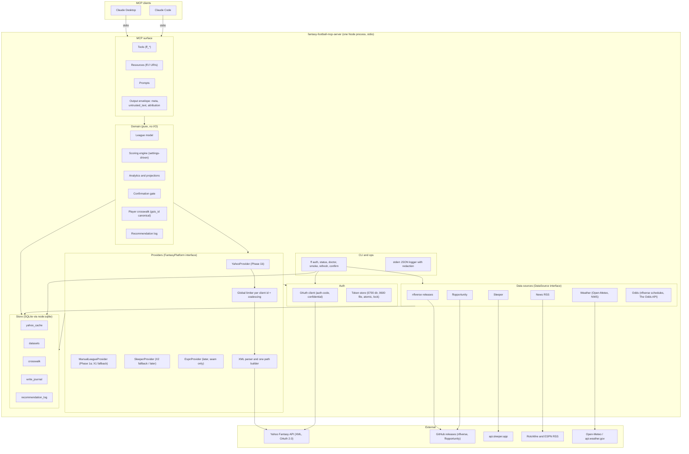

# 01 — System architecture

**Author:** `architecture-planner-core` · **Date:** 2026-09-29 · **Brief:** `docs/scratch/briefs/architecture-planner-core.md`
**Inputs (not re-derived here):** `docs/HANDOFF.md`; `docs/research/03-yahoo-api.md` (03); `02-prior-art-lessons.md` (02); `04-data-sources.md` (04); `05-strategy-and-analytics.md` (05) §0/§12/§15/§16/§19; the mcp-builder references (`mcp_best_practices.md`, `node_mcp_server.md`, `evaluation.md`); the MCP specification **revision 2026-07-28** (read 2026-09-29 at modelcontextprotocol.io — the latest published revision; `draft` also exists); the TypeScript SDK README + `docs/protocol-versions.md` (read 2026-09-29); the npm registry (read 2026-09-29).
**Yahoo-dependency:** `read` — `YahooProvider`, auth placement, the limiter and the Yahoo cache (§5.3, §6, §8–§9). **`none`** for the store, every `DataSource`, the scoring engine, the `FantasyPlatform` seam itself, the envelope and the error contract — which is what `ManualLeagueProvider` (X1) and `SleeperProvider` (X2) run on if Yahoo never grants read. *(tag added round 1, D.2 item 1: what survives a Yahoo denial is visible at a glance.)*

## How to read this document

| Mark | Meaning |
|---|---|
| **[V-03 §x]** etc. | Verified in the cited research doc section. Cite, do not re-derive. |
| **[V-spec]** | Stated on a page of the MCP specification revision 2026-07-28, read 2026-09-29. |
| **[V-sdk]** | Stated in the TypeScript SDK README or `docs/` on `main`, read 2026-09-29. |
| **[V-npm]** | Read from the npm registry document, 2026-09-29. |
| **[V-node]** | Read from nodejs.org/api — the **v24.x** line unless stated. Re-read 2026-09-30 (log §1.0, §D.0): the 2026-09-29 read conflated the v22 and v24 lines' `node:sqlite` stability (OBJ-09); every `[V-node]` below now names the line. |
| **[A]** | Assumed. Listed by name in §13. The devil's advocate should attack these first. |

Every decision below carries **decision · why · alternative considered · what would change it**. "Deferrable" means: the seam is designed now, the component is built later without touching the seam.

---

## 0. Decisions at a glance

| # | Decision | Why | Alternative considered | What would change it |
|---|---|---|---|---|
| D1 | **Single Node process, single npm package, stdio transport only** in v1 | One user, one machine, one client at a time; the spec says stdio servers take credentials from the environment rather than implementing the authorization spec [V-spec authorization "Protocol Requirements"]; every failure mode Chad has hit (brief fact 10) is a local-process problem, and fewer processes means fewer of them | Streamable HTTP alongside stdio (prior art D, 02 §3.9) | A second user, or a wish to install from claude.ai — see §3.3 (a clean negative today) |
| D2 | **SDK = `@modelcontextprotocol/server` v2, exact-pinned (2.2.0 at time of writing)**, **Node ≥ 24.15** *(revised round 1, OBJ-09: was ≥ 22.13)* | v2 is "the stable release line, released alongside the 2026-07-28 spec"; its `serveStdio` "serves both eras" — legacy `initialize` clients and 2026-07-28 clients — by default [V-sdk protocol-versions.md]; v1 gets "bug fixes and security updates for at least 6 months after v2's release" (v2.0.0: 2026-07-27 [V-npm]) — i.e. v1 is on a clock. The Node floor comes from `node:sqlite`: on the **v24 line** it is "Stability: 1.2 – Release candidate" (history: "v24.15.0: SQLite is now a release candidate") [V-node v24.x, 2026-09-30]; on the **v22 line** it is "Stability: 1.1 – Active development … still experimental" and prints `ExperimentalWarning` on every start (observed on 22.23.2 — HANDOFF "Stack facts"); the SDK needs only `engines.node >=20` [V-npm] | Node ≥ 22.13 with the warning documented and the exact `DatabaseSync`/`StatementSync` surface pinned (the advocate's alternative); v1 `@modelcontextprotocol/sdk` 1.31.0 (the API the house reference `node_mcp_server.md` shows) | Never downward. A v2 advisory, or a Claude Desktop stdio regression against v2's dual-era handling found in the Inspector/Desktop smoke (05 §5) → fall back to v1 ≥ 1.31.0 (never ≤ 1.25.3, the advisory line [V-02 §3.10]) |
| D3 | **Yahoo is parsed as XML** (`fast-xml-parser`), not `?format=json` | XML is the documented contract; JSON is an undocumented transliteration with five parser traps [V-03 §B.6] | JSON + a normaliser (what every wrapper does) | Yahoo documenting JSON, or dropping XML |
| D4 | **Store = SQLite through `node:sqlite`**, in `~/.cache/<app>/`; tokens in `~/.config/<app>/` | No native addon → no `postinstall`, no compiler, no prebuilt-binary supply chain (02 §5, plan 02 §7); "Stability: 1.2 – Release candidate" **on the v24 line** (v24.15.0: "SQLite is now a release candidate") [V-node v24.x, 2026-09-30] — the v22 line is "1.1 – Active development" and warns at startup, which is why the floor is 24.15 (D2) *(corrected round 1, OBJ-09: the earlier text cited v24's stability with v22's version)*; on v24, `sqlite.backup(sourceDb, path[, options])` returns a **Promise** (plan 03 §7 uses it; the v22 signature differs) [V-node v24.x]; one file, transactional, queryable, ~zero ops | `better-sqlite3` (native, prebuild scripts); JSON files per dataset (no joins, no atomic multi-table refresh); DuckDB (native, heavy) | `node:sqlite` regressing or being removed from a Node release we need; a dataset too large for SQLite's comfort (none is — §5.6) |
| D5 | **Every Yahoo read is cache-first behind one global token-bucket limiter per client id**, with in-flight coalescing and 999-aware backoff | Throttling is per client id, HTTP 999, undocumented [V-03 §D.1]; every response says `refresh_rate="60"` [V-03 §D.2] | Per-tool ad-hoc caching (what prior art does: none [V-02 §1]) | Yahoo publishing numbers — then the limiter gets real constants instead of §6's assumed ones |
| D6 | **Every result carries `meta.as_of`, `meta.fetched_at`, `meta.age_s`, `meta.freshness`, `meta.attribution`**; free text only inside `untrusted_text` | Stale-data labelling rule (brief); portal attribution terms [V-HANDOFF]; untrusted-text labelling (02 §5) | Freshness only in the text block | Nothing — this is the output contract |
| D7 | **External data is file-release ingestion, not API clients**: poll `timestamp.txt`, download parquet (`hyparquet`, pure JS), assert schema **and codec**, load into SQLite. **Codec (round 1, OBJ-20 — closed with evidence):** nflverse writes parquet with `arrow::write_parquet(d, path)` and no compression argument (`nflverse/nflverse-data` `R/upload.R` line 85, read 2026-09-30 by the orchestrator — log §D.0), so Arrow R's default applies — `compression = "snappy"` ("if available, otherwise uncompressed"; arrow.apache.org `write_parquet` reference) — and hyparquet reads uncompressed and snappy natively (hyparam/hyparquet README, 2026-09-30); no `hyparquet-compressors`. The loader **asserts the codec** of every column chunk is `SNAPPY` or `UNCOMPRESSED` at load and fails loudly otherwise (a release switching to zstd/gzip becomes a red `refresh_log` row, not a silent miss) | 04 §G.3 verbatim: "download-if-`timestamp.txt`-changed, load parquet, assert schema"; nflverse renames files and columns about once per off-season [V-04 §B1] | CSV twins (55 MB daily for depth charts vs 2.66 MB parquet [V-04 §B1]); an R/Python sidecar (a second runtime) | Parquet schemas turning out to differ from the CSV twins (04 §H.8 — the loader's schema assertion will say so on first run) |
| D8 | **Refreshes run in a separate CLI process (`ff refresh`), scheduled by launchd**, loading into an **attached staging database** and swapping into the shared WAL store in one millisecond-class transaction; the MCP server never *loads datasets* — it does write its own tables (`yahoo_cache`, `write_journal`, `recommendation_log`, `crosswalk`, `limiter_state`, `league_settings`, `points_cache`), best-effort for caches and bounded (`STORE_BUSY`) for the rest (§5.3) *(revised round 1, OBJ-11: "the server only reads" was false)* | `node:sqlite` is synchronous [V-node, both lines] — a 30 MB parquet load inside the server would stall the stdio loop mid-conversation, and a cache write meeting a refresh's write lock with `busy_timeout=5000` would block a tool call for 5 s on a Sunday; refreshes must run when no client is open (plan 06) | In-process background timers; a 5-s `busy_timeout` (the earlier draft) | Node shipping an async `node:sqlite` API, and only if in-process refresh buys something |
| D9 | **Tool prefix `ff_`, server name `fantasy-football-mcp-server`**; platform never appears in tool names | House naming `{service}-mcp-server`, snake_case with a service prefix (mcp_best_practices); the ESPN seam (brief fact 11) means tool names must not say "yahoo" | `yahoo_` prefix | Never adding a second platform — even then `ff_` costs nothing |
| D10 | **No remote error reporting** | Single user, local, data is one person's league; stderr + `ff status` + `ff doctor` cover diagnosis; every remote sink is a new trust boundary (02 §6 saw an undeclared LLM sink) | Sentry with PII scrubbing | Distribution to other users (then opt-in, scrubbed, documented) |
| D11 | **Confirmation gate is a first-class domain service, not a tool-handler convention** (`prepare_*`/`commit_*`, HMAC-bound diff, precondition hash, human channel) — specified in plan 02. Its human channels are unforgeable **only in clients where the model has no OS access as the user** (Claude Desktop chat, claude.ai); in Claude Code the gate is defence-in-depth and writes are unsupported by default (plan 02 §0 rule, §4.2) *(revised round 1, OBJ-01)* | 02 §4 #5: nobody has one; it must be impossible to bypass **by adding a tool** — a server-side property that holds in every client; whether a *human channel* can be forged is per client | Client-side approval prompts only | Nothing |

---

## 1. Component diagram



Reading the arrows: the **domain never imports a wire type** (no `fantasy_content`, no nflverse column names); providers and sources translate into domain types at their boundary. The **MCP surface never touches the store or the network**; it validates, calls the domain, and wraps. The **store is a leaf** — it depends on nothing above it. Enforced by an ESLint `no-restricted-imports` rule per directory (plan 04 §3).

### 1.1 Module map (what lives where)

| Layer | Directory | Owns | Must not import |
|---|---|---|---|
| MCP surface | `src/mcp/` | tool/resource/prompt registration, zod input schemas, the envelope, error mapping, pagination, truncation | `src/store`, `src/providers/*/wire`, `node:fs`, `fetch` |
| Domain | `src/domain/` | league model, scoring engine, analytics, projections, crosswalk matcher, confirmation gate, recommendation log (as pure functions over injected repositories) | `@modelcontextprotocol/*`, provider wire types, `fetch` |
| Providers | `src/providers/<platform>/` | `FantasyPlatform` implementation, path builder, XML parsing, limiter, cache policy for platform reads | `src/mcp` |
| Data sources | `src/sources/<name>/` | `DataSource` implementation: fetch, schema assertion, load | `src/mcp`, `src/providers` |
| Store | `src/store/` | SQLite schema, migrations, repositories | everything else |
| Auth | `src/auth/` | OAuth client, token store, lockfile, secret loading | `src/mcp`, `src/domain` |
| CLI/ops | `src/cli/` | `ff` subcommands, logger, doctor checks, launchd plist generator | — (it may import anything; nothing imports it) |

---

## 2. Process model

- **One process per client session**, spawned by the client with `command` + absolute `args` (plan 03 §4). No daemon, no shared server between Claude Desktop and Claude Code — two clients open at once means two processes sharing the SQLite file (WAL) and the token file (lockfile + rotation rule, plan 02 §3). *Why:* stdio is what both clients speak, and the spec says "the client launches the MCP server as a subprocess" [V-spec stdio]. *Alternative:* one long-lived local HTTP server shared by clients — rejected in D1. *What would change it:* token-rotation collisions between two processes observed in practice (the lockfile is designed to prevent them; plan 05 tests the race).
- **Refresh jobs are a different process** (`ff refresh …`, D8), never the server.
- **Protocol on stdout, everything else on stderr** — the server "MUST NOT write anything to its stdout that is not a valid MCP message" and "MAY write UTF-8 strings to stderr for any logging purposes" [V-spec stdio]. No `console.log` anywhere under `src/` except `src/cli/` (ESLint `no-console` with a per-directory override, plan 04). The logger writes to `process.stderr` only.
- **Shutdown**: "Servers SHOULD exit promptly when their standard input is closed or reads return end-of-file. This is the primary graceful-shutdown signal and the only portable one" [V-spec stdio]. Plan 03 §1 specifies the sequence (flush journal, checkpoint WAL, close DB, release lock, exit 0) and the parent-death watchdog.

---

## 3. Transport

### 3.1 stdio (primary, only transport in v1)

- **Decision:** `serveStdio(...)` from the v2 SDK in its default dual-era mode [V-sdk protocol-versions.md: "serveStdio(factory) similarly serves both eras unless configured otherwise"]. *Why:* Claude Desktop and Claude Code are the two clients; Claude Code declares 2026-07-28 elicitation support "on connections using protocol revision 2026-07-28" (plan 02 §4 cites the source) while Claude Desktop's era is **[A-1]** — dual-era costs nothing and removes the question. *Alternative:* pin one era. *What would change it:* the SDK dropping legacy-era serving (its own 6-month v1 window suggests the legacy era will be served for a while, but this is [A-2]).
- The 2026-07-28 revision is **stateless**: no `initialize`; every request carries protocol version and client capabilities in `_meta`; `server/discover` advertises versions and capabilities; results carry `resultType` [V-spec changelog 1–3, 8]. Consequence for us: **no per-connection state, ever**. Anything that must survive between two tool calls (a prepared write, a pagination cursor) is an explicit, server-minted handle stored in SQLite [V-spec tools "Stateful Tools"]. The confirmation token in plan 02 is exactly such a handle.
- Logging as a *protocol feature* is deprecated in 2026-07-28 ("log to `stderr` (stdio)" is the suggested migration) [V-spec changelog Deprecated 1]. We never emit `notifications/message`; stderr is the log.
- `tools/list`, `prompts/list`, `resources/list`, `resources/read` results **MUST** carry `ttlMs` and `cacheScope` [V-spec caching]. We return `ttlMs: 300000, cacheScope: "private"` for lists (the tool set can change when provisioning changes — plan 02 §5) and per-resource TTLs from the freshness table (§5.4); everything is `"private"` because every payload is one user's league.
- Tool ordering in `tools/list` is deterministic (spec SHOULD; it "improves LLM prompt cache hit rates") [V-spec tools "Capabilities"]: registration order is fixed by a single `src/mcp/registry.ts` list. The list is filtered, in order, by **`FF_TOOLSET`** (`core` — the default — registers the 19 P0 tools; `full` adds the P1/P2 analytics; plan 07 C3, *round 1, OBJ-08*) and then by capability (write tools, plan 02 S5); the order of the survivors never changes.

### 3.2 Streamable HTTP — not offered in v1, and what would have to change

**Decision: not offered.** *Why:* it is for "remote servers, multi-client scenarios" (mcp_best_practices); we have one user. Offering it locally adds the DNS-rebinding surface the spec warns about ("Servers MUST validate the `Origin` header", "SHOULD bind only to localhost", "SHOULD implement proper authentication for all connections" [V-spec streamable-http "Security & Endpoint"]) for no benefit. *Alternative:* offer it behind a flag "for later". Rejected: an unused, untested transport is the code that ships broken.

If it is ever offered, the following change — recorded so the seam is honest:

| Concern | stdio (v1) | Streamable HTTP (later) |
|---|---|---|
| Who authenticates the *client* | the OS: the client spawned us | the server becomes an **OAuth 2.1 resource server** with Protected Resource Metadata, token audience validation, and an authorization server (own or delegated) [V-spec authorization "Roles", "Overview"]; 02 §3.9 describes the only prior-art implementation (D) — `.well-known` discovery, PKCE S256, redirect allow-list, tokens encrypted at rest |
| Yahoo tokens | one user's tokens in a 0600 file | per-MCP-user token binding; "MCP server is responsible for tokens" and "MUST NOT transmit credentials obtained through URL mode elicitation to the MCP client" [V-spec elicitation "URL Mode Elicitation for OAuth Flows"] |
| Yahoo login | `ff auth` (plan 02 §2) | URL-mode elicitation to a connect page that verifies the MCP user before redirecting to Yahoo (the phishing mitigation in [V-spec elicitation "Phishing"]) |
| Sessions | none (stateless spec) | none — 2026-07-28 removed `Mcp-Session-Id` [V-spec changelog Major 1]; handles in SQLite already fit |
| Headers | none | `MCP-Protocol-Version`, `Mcp-Method`, `Mcp-Name` required on every POST [V-spec streamable-http "Request Metadata"] |
| Binding | n/a | `127.0.0.1` only, `Origin` validated, 403 otherwise |

### 3.3 Remote install from claude.ai — a clean negative today

Not achievable under the verified constraints: it needs a **publicly reachable https** MCP endpoint acting as an OAuth resource server (§3.2), a **hosted** Yahoo callback (Yahoo requires https callbacks and matches them against the app registration [V-03 §A.1]), and it would put one developer's single Yahoo client id (portal: single account [V-HANDOFF]) behind a multi-user service — which is the confused-deputy shape the spec's security page spends its first section on [V-spec security_best_practices "Confused Deputy Problem"]. The honest alternative is the one built here: a local stdio server per machine, `ff auth` once, tokens local. What would change it: Yahoo approving a multi-user application *and* Chad wanting to host.

---

## 4. MCP surface conventions

These conventions bind every tool the product planner defines (plan 07+). They are enforced by a single registration helper (`defineTool()` in `src/mcp/define.ts`) so a tool cannot be registered without annotations, the envelope, and — except for the large list tools named in plan 07 C10, whose `data` shape is documented in `ff://docs/tool-outputs` instead *(round 1, OBJ-08)* — an output schema.

### 4.1 Naming

- Server name `fantasy-football-mcp-server`, version from `package.json`.
- Tool names: `ff_<verb>_<resource>`, snake_case, ASCII letters/digits/underscore only, ≤ 40 characters (spec allows up to 128 and `-`/`.`; we stay well inside the "SHOULD" set [V-spec tools "Tool Names"]). Verbs: `get`, `list`, `search`, `analyze`, `project`, `compare`, `prepare`, `commit`, `cancel`, **`record`** (a local-store write, not a platform write — `ff_record_recommendation`; T1, round 1).
- Families (namespaces inside the prefix), so a reader can tell a Yahoo fact from our estimate:

| Family | Example | Source of truth | Annotations |
|---|---|---|---|
| Platform facts | `ff_get_roster`, `ff_list_free_agents` | provider (Yahoo) | `readOnlyHint: true`, `idempotentHint: true`, `openWorldHint: true` |
| Our analytics | `ff_project_player`, `ff_analyze_start_sit` | domain, labelled ours (04 §G.1) | `readOnlyHint: true`, `idempotentHint: false` (depends on cache state), `openWorldHint: false` |
| External text | `ff_get_player_news` | news sources; all text `untrusted_text` | `readOnlyHint: true`, `openWorldHint: true` |
| **Local write** (journal / log) *(added round 1: T8 + OBJ-19)* | `ff_record_recommendation`, `ff_prepare_*`, `ff_cancel_prepared` | our store only; **no side effect on Yahoo** — but a `prepare` inserts a journal row, mints `gate_key` on first use and (channel 2) fires a notification, so it is *not* read-only in the spec's sense ("does not modify its environment") | `readOnlyHint: false`, `destructiveHint: false`, `openWorldHint: false`; `idempotentHint: true` for `record` (dedup on `client_ref`), `false` for `prepare_*`/`cancel_prepared` |
| Write — commit | `ff_commit_lineup` | provider write | `readOnlyHint: false`, `destructiveHint: true` (drops are final [V-02 §4 #5]), `idempotentHint: true` (a second commit with the same token is a no-op — plan 02 §4), `openWorldHint: true` |
| Ops | `ff_get_status` | store + auth | `readOnlyHint: true`, `openWorldHint: false` |

*The earlier draft labelled `prepare_*` `readOnlyHint: true` ("it writes only our journal"). Withdrawn (OBJ-19): if any client auto-approves read-only tools (research 06 U-1, unresolved), a `prepare` would run without the user seeing it — the mislabel the spec warns clients about.*

*Why annotations per family and not per tool:* the reference says "Provide tool annotations" and the spec says clients "MUST consider tool annotations to be untrusted unless they come from trusted servers" [V-spec tools "Tool"] — they are a hint to the client UI, not our security boundary (plan 02 is). *Alternative:* omit `idempotentHint` (its default is false). Kept: commit idempotency is real and documented.

- Resources: URI scheme `ff://` (custom schemes "MUST be in accordance with RFC3986" [V-spec resources "Custom URI Schemes"]): `ff://league` (the configured league identity — 02 §3.7's pattern; set by the operator, never by the model), `ff://league/settings`, `ff://status`. Resources are application-driven [V-spec resources "User Interaction Model"]; they carry the same envelope as tools. The product planner may add more under `ff://`.
- Prompts: `ff.<workflow>` names (dots allowed for prompts as for tools); user-controlled [V-spec prompts]. They must **state the untrusted-text rule** in their text (plan 02 §6).

### 4.2 Output contract

Every tool returns one `text` block holding the envelope as serialised JSON ("For backwards compatibility, a tool that returns structured content SHOULD also return the serialized JSON in a TextContent block" [V-spec tools "Structured Content"]). Tools that carry an `outputSchema` (all but the large list tools of plan 07 C10) **also** return a `structuredContent` object validated against it ("Servers MUST provide structured results that conform to this schema" [V-spec tools "Output Schema"]) — **except that the list tools omit `structuredContent` until the OBJ-06 spike answers whether the clients forward both copies to the model** (research 06 §A.6's rule; plan 10 A17: `ff_debug_echo` returns a nonce only in `structuredContent`, each client is asked to repeat it, the answer goes to HANDOFF "Stack facts", and plan 07 §5.1 is re-based on measured tokens per client) *(revised round 1, OBJ-06)*. No Markdown mode. *Why:* the reference suggests markdown + json; 02 §4 #4 shows what happens when the text is not machine-parseable, and one format halves the test surface. *Alternative:* `response_format` parameter. *What would change it:* nothing toward a second copy — the earlier "Markdown as a second text block" clause is **deleted** (it would be a third serialisation of the same data); if A17 shows a client forwards only one copy, list tools regain `structuredContent`.

The envelope (`src/mcp/envelope.ts`, zod-typed, versioned):

```jsonc
{
  "data": { /* tool-specific, matches outputSchema.data */ },
  "meta": {
    "schema_version": 1,
    "source": ["yahoo", "nflverse:stats_player_week"],   // every source that contributed
    "as_of": "2026-09-29T15:46:00Z",     // newest input timestamp (Yahoo response time, release updated_at)
    "fetched_at": "2026-09-29T23:10:12Z",// when WE last fetched the oldest contributing item
    "age_s": 7452,                       // now - fetched_at, computed at response time
    "freshness": "fresh",                // fresh | stale | provisional  (rule in §5.5)
    "provisional": false,                // Yahoo scoring not yet final for the week (03 §D.2)
    "attribution": [
      { "source": "Yahoo Fantasy", "text": "Fantasy data provided by Yahoo Fantasy", "url": "https://football.fantasysports.yahoo.com/" },
      { "source": "nflverse", "license": "CC-BY-4.0", "url": "https://github.com/nflverse/nflverse-data" }
    ],
    "untrusted_fields": [                // every third-party string in `data`, by JSON path (round 1, OBJ-07 / OBJ-15):
      { "path": "data.players[].name",         "source": "yahoo.player.name" },          //   bare string (Yahoo-authored player name)
      { "path": "data.teams[].name",           "source": "yahoo.team.name" },            //   wrapped (manager-authored)
      { "path": "data.players[].injury_note",  "source": "yahoo.player.injury_note" },   //   wrapped (editor-authored)
      { "path": "data.calls[].recommended",    "source": "store.recommendation_log" }    //   our own store, written by the model (OBJ-15)
    ],
    "estimate": false                    // true for every number that is ours, not the platform's (04 §G.1)
  },
  "page": { "limit": 25, "offset": 0, "count": 25, "has_more": true, "next_offset": 25 },  // list tools only
  "truncated": false,                    // see size budget
  "warnings": []                         // e.g. "source nflverse:injuries is 31h old"
}
```

- **Attribution** is mandatory on every result that used Yahoo data: the portal's exact wording, with the link [V-HANDOFF]. The logo requirement is met in `README.md` and the docs (docs-writer's file); a JSON payload cannot carry a logo, so the text+link form is what tool output uses. The Skills bundle and prompts repeat the wording where they render summaries.
- **Untrusted-text labelling — two mechanisms, one per text class** *(revised round 1, OBJ-07)*, both under plan 02 §6's caps/stripping/NFC rules:
  1. **Manager- or editor-authored text** — team names, manager nicknames, league name, trade notes, `injury_note`, `status_full`, news titles/blurbs, depth-chart position names, nflverse `desc` play text, Sleeper `injury_notes`, RSS anything — is emitted inside the **`untrusted_text` wrapper** `{"untrusted_text": {"value": "...", "source": "yahoo.team.name", "chars": 17, "truncated": false}}`, never as a bare string. The wrapper is kept for these classes because they are where injection actually arrives, and its `source` tag and truncation state are what the `news-check` reliability model reads (05 §10).
  2. **Yahoo-authored player names** are emitted as **bare strings** (cap 64, stripped, NFC) and labelled by JSON path in **`meta.untrusted_fields[]`** with `source: "yahoo.player.name"`. Wrapping them cost ~40 % of a list payload for a class with no injection exposure (names are Yahoo's, not a manager's); the path list gives the model and the Skills the same label for a few dozen chars per result. `tests/mcp/size.test.ts` records the before/after on the fixture league (plan 10 A6).
  3. **Our own store** — the recommendation log's model-authored free text (`note`, `assumptions[].text`, `drivers[].name`, `alternatives[].action`, `action`) — is listed in `meta.untrusted_fields[]` with `source: "store.recommendation_log"` on every read (plan 07 E13/E14, `ff://rec/*`), because what the model wrote under an injected blurb's influence must not come back next week as "our own record" *(round 1, OBJ-15)*.
  `meta.untrusted_fields[]` therefore lists **every** third-party or model-authored string in `data` — wrapped or bare — as `{ path, source }`; a test walks every tool's output and asserts the list is complete.
- **Size budget:** 20 000 characters of serialised JSON per result (the reference's `CHARACTER_LIMIT` is 25 000; we keep headroom for the client's own framing). Over budget → the list is halved until it fits, `truncated: true`, and a warning says how to page or filter. Non-list results over budget are a bug (fail the test in plan 05 §2).
- **Pagination:** `limit` (default 25, max 100) + `offset`; `page.has_more`/`next_offset`; Yahoo free-agent reads page at 25 natively [V-03 §B.2] so the server fetches ⌈limit/25⌉ pages behind one call and reports the true `offset`. Transactions are "most recent N" only [V-03 §B.2]; the tool says so in its description and `page.has_more` is always `false` for it.

### 4.3 Error contract

Tool execution errors are returned "in tool results with `isError: true`" so the model can self-correct [V-spec tools "Error Handling"]; protocol errors are reserved for unknown tools and malformed requests. Shape:

```jsonc
{ "error": { "code": "NOT_PROVISIONED", "message": "This Yahoo app is not provisioned for the Fantasy API (HTTP 403).",
             "hint": "Run `ff doctor`. Apply at sports.yahoo.com/developer/access. Refreshing the token will not help.",
             "retryable": false, "upstream_status": 403, "request_id": "r-8f2c" } }
```

| Code | Meaning | Retryable | Source of the rule |
|---|---|---|---|
| `NOT_AUTHENTICATED` | no token store / never logged in | no (run `ff auth`) | plan 02 |
| `TOKEN_REFRESH_FAILED` | refresh returned `invalid_grant` (revoked / password change) | no (run `ff auth`) | [V-03 §A.2] |
| `NOT_PROVISIONED` | `401 additional_authorization_required` or `403 not authorized` — **terminal**, never retried as a token problem | no | [V-03 §A.2 "Design rule"] |
| `WRITE_NOT_AVAILABLE` | write tool called while the app has read scope | no | brief fact 1 |
| `RATE_LIMITED` | 999 / connection reset after backoff exhausted | yes, after `retry_after_s` | [V-03 §D.1] |
| `UPSTREAM_UNAVAILABLE` | 5xx / timeout after backoff — **and any network error** (`ENOTFOUND`, `ECONNREFUSED`, `EAI_AGAIN`, offline `fetch` `TypeError`) on a Yahoo call or a refresh, which is classified here and never as `INTERNAL` *(round 1, OBJ-22)*; stale cache (if any) is returned in `data` with `freshness: "stale"` and this code in `warnings` instead of failing | yes | §5.7 |
| `STALE_ONLY` | only data older than the hard limit exists and `allow_stale` was not set | yes | §5.5 |
| `STORE_BUSY` | a **required** local write (`write_journal`, `recommendation_log`, crosswalk persistence) could not take the SQLite write lock within ≤ 1 s of retries — usually a refresh's swap or a second client process; the `hint` says so and names the retry *(added round 1, OBJ-11)* | yes, shortly | §5.3 |
| `INVALID_KEY` | argument fails the Yahoo key grammar | no | plan 02 §5 |
| `VALIDATION` | zod failure (field, reason) | no | plan 02 §5 |
| `NOT_FOUND` | Yahoo "data not found" description / empty resource | no | [V-03 §B.6] |
| `CONFIRMATION_REQUIRED` / `CONFIRMATION_EXPIRED` / `PRECONDITION_CHANGED` / `CONFIRMATION_DENIED` | confirmation gate states | see plan 02 §4 | plan 02 |
| `INTERNAL` | anything else; `request_id` links to the stderr log line | no | — |

Rules: **no upstream body ever appears in a tool result** (02 §4 #6: Yahoo returns HTML on some errors); the body, HTML-stripped and truncated to 500 chars, goes to the stderr log under the same `request_id`, after redaction (§7). Error `message`s are fixed strings from a table, never interpolated upstream text.

---

## 5. Data ingestion, caching, freshness

### 5.1 Storage decision (D4, expanded)

SQLite, one file `~/.cache/fantasy-football-mcp/store.sqlite` (override `FF_CACHE_DIR`), WAL mode, `synchronous=NORMAL`, `foreign_keys=ON`, a `schema_version` table with forward-only migrations (plan 03 §6). Everything that is not a secret lives here: the Yahoo response cache, loaded datasets, the crosswalk, the write journal, the recommendation log, refresh bookkeeping. Secrets never do (plan 02 §3). **Never pruned** (T5, round 1): `recommendation_log`, the `league_settings` rows it references, and `write_journal` — `store prune` (plan 06 §1.2) touches caches, news, temp files and old backups only.

*Why one file and not one per concern:* one transaction can refresh a dataset and its bookkeeping atomically; `ff status` is one query; backup is one copy. *Alternative:* separate files for journal/log (audit isolation). *What would change it:* a wish to ship the journal elsewhere — it is one table to move.

The cache directory is **outside the repo and outside iCloud** (`~/.cache` and `~/.config` are not in "Desktop & Documents" sync [V-HANDOFF decisions]). On macOS we still use `~/.config`/`~/.cache` (XDG names) rather than `~/Library/…`: it matches the audited prior art (K, D-local [V-02 §3.4]), it is what Chad's other local servers do **[A-3]**, and it is one code path for macOS/Linux. `XDG_CONFIG_HOME`/`XDG_CACHE_HOME` are honoured.

### 5.2 Data classes

Cadences and sizes are from 04 §B/§E; TTLs and hard limits are ours (the "assumed" numbers are marked). "When down" is what a tool call sees while the source is unreachable.

| Data class | Source | Refresh cadence (source) | Our fetch trigger | TTL (fresh) | Hard limit (then `STALE_ONLY`) | Invalidation trigger | Storage | Size | When source down |
|---|---|---|---|---|---|---|---|---|---|
| League settings (scoring, slots, rules) | Yahoo `league/{k}/settings` [V-03 §B.2] | rarely (commissioner edits) | on demand, cache-first | 24 h **[A-4]** | 7 d | `ff refresh --settings`; a scoring golden-test mismatch (plan 05) marks it dirty; `league_update_timestamp` change (what it tracks is [U] per 03 §D.2 — used as a hint only) | `yahoo_cache` + parsed `league_settings` (hash-keyed) | ~50 KB | serve cached; settings older than 7 d → `STALE_ONLY` |
| Rosters (mine + others) | Yahoo `team/{k}/roster;week=N` (+`out=`) [V-03 §B.3] | live | on demand | 60 s (= `refresh_rate`) | 24 h | any successful `commit_*`; week rollover | `yahoo_cache` | ~20 KB/team | serve stale ≤ 24 h with warning |
| Free agents / waiver wire | Yahoo `league/{k}/players;status=FA…` 25/page [V-03 §B.2] | live | on demand per page | 5 min **[A-5]** | 24 h | successful `commit_*`; nightly snapshot job (plan 06) | `yahoo_cache`; nightly `fa_pool_snapshot` table for diffs | ~15 KB/page | serve stale with warning |
| Scoreboard / matchups / standings | Yahoo scoreboard, matchups, standings [V-03 §B.2] | live during games, `refresh_rate=60` | on demand | 60 s during game windows (from `schedules` kickoff times), 15 min otherwise **[A-6]** | 24 h | week rollover | `yahoo_cache` | ~30 KB | serve stale with warning |
| Player weekly stats (Yahoo, league-scored) | Yahoo `league/{k}/players;player_keys=…/stats;type=week` ≤ 25 keys [V-03 §B.4] | live; **final after next week's first kickoff** [V-03 §D.2] | on demand; golden tests | 10 min while provisional; **immutable** once final | never for final weeks | week finalisation clock | `player_week_stats` (parsed, keyed by player_key, week) | ~200 B/row | serve cached; provisional weeks flagged |
| Transactions (most recent N) | Yahoo `league/{k}/transactions;count=N` [V-03 §B.2] | live | on demand + nightly append (plan 06) | 2 min | 24 h | `commit_*` (reconcile) | `yahoo_cache` + `transactions_seen` (append-only, our persistence of history since "most recent N" cannot page [V-03 §E]) | ~1 KB/txn | serve stale |
| Pending waivers / trades (mine) | Yahoo `transactions;types=waiver,pending_trade;team_key=` [V-03 §B.2] | live | on demand | 60 s | 6 h | `commit_*` | `yahoo_cache` | small | serve stale |
| Weekly player stats, usage shares, EPA | nflverse `stats_player_week_YYYY` parquet [V-04 §B1] | nightly + game-day points | `ff refresh nflverse` (launchd nightly + game-day, plan 06) polls `timestamp.txt` | until next release (`timestamp.txt` unchanged) | 3 d in season **[A-7]** | `timestamp.txt` changed | `ds_stats_player_week` | ~1.5 MB/season | serve last load with age in `meta`; `warnings` |
| Play-by-play (subset of 372 cols) | nflverse `play_by_play_YYYY` parquet [V-04 §B1] | "within ~15 min after a game" | same job | same | 3 d | same | `ds_pbp` (projected to ~40 columns) | ~10 MB/season projected **[A-8]** | same |
| Snap counts | nflverse `snap_counts_YYYY` [V-04 §B1] | 4×/day | same job | same | 3 d | same | `ds_snap_counts` | ~0.5 MB | same |
| Injuries + practice | nflverse `injuries_YYYY` [V-04 §B1] | daily 07:00 UTC (observed ~14:00) | `ff refresh injuries` (launchd 2×/day + Wed–Sat afternoons) | 12 h | 36 h | `timestamp.txt` | `ds_injuries` | ~100 KB | serve last; Sleeper `injury_status` as secondary if fresher [V-04 §A #6] |
| Depth charts | nflverse `depth_charts_YYYY` **parquet** (CSV is 55 MB) [V-04 §B1] | daily | daily job | 24 h | 4 d | `timestamp.txt` | `ds_depth_charts` (latest snapshot per team only) | ~1 MB | serve last |
| Weekly rosters + ids | nflverse `roster_weekly_YYYY` [V-04 §B1] | daily | daily job | 24 h | 7 d | `timestamp.txt` | `ds_roster_weekly` → feeds `crosswalk` | ~0.5 MB | serve last; crosswalk keeps persisted pairs |
| Expected fantasy points | ffopportunity `ep_weekly_YYYY` (CC-BY-SA) [V-04 §B2] | daily ~11:35 UTC | daily job | 24 h | 4 d | release `updated_at` | `ds_ep_weekly` | ~1 MB | serve last |
| Schedule, kickoffs, roof, **lines** | nflverse `schedules` `games` [V-04 §B1] | every 5 min in season | `ff refresh schedules` every 30 min on game days, 6 h otherwise **[A-9]** | 30 min | 24 h for lines; schedule itself 7 d | `timestamp.txt` | `ds_schedules` | ~2 MB all seasons | lines stale-labelled; kickoff times keep working from last load |
| Odds (multi-book) — optional | The Odds API free tier, 2 credits/poll [V-04 §B6] | live | ≤ 3×/day, only if `ODDS_API_KEY` set | 8 h | 24 h | job | `ds_odds` | small | nflverse lines are primary; this is secondary |
| Weather | Open-Meteo (non-commercial) / NWS (US venues) [V-04 §B7–B8] | hourly | at most hourly per venue, only for the coming week's outdoor games (`roof` from schedules) | 1 h | 12 h | job | `ds_weather` | small | omit weather driver, say so in `assumptions[]` |
| Trending adds/drops | Sleeper `trending/add|drop` (non-commercial) [V-04 §B4] | CDN 600 s | every 30 min in season | 30 min | 6 h | job | `ds_trending` | small | omit signal |
| Sleeper players (ids, injury fields) | Sleeper `players/nfl` 5 MB, "once per day at most" [V-04 §B4] | daily | daily job, `gsis_id` trimmed | 24 h | 7 d | job | `ds_sleeper_players` | ~15 MB decompressed → ~3 MB stored (columns projected) | serve last |
| DynastyProcess ids | `db_playerids.csv` weekly [V-04 §B3] | weekly Fri | weekly job | 7 d | 30 d | commit date | `crosswalk` seeds | 2.6 MB | serve last |
| News | RotoWire RSS (5 items), ESPN RSS (28 headlines) [V-04 §B10] | continuous | every 15 min in season (RotoWire's window is 5 items — persist or lose) | 15 min | 24 h | job | `ds_news` (append-only, dedup by guid/link, 30-day retention) | ~5 MB/season | serve stored items with age |
| Player crosswalk | derived (04 §D) | — | after roster_weekly / Sleeper / DP loads and after any Yahoo player list read | persisted pairs never expire | — | manual override file change | `crosswalk` (yahoo_player_id, gsis_id, method, confidence, first_seen, last_seen) | ~100 KB | n/a |

### 5.3 The Yahoo cache

- Key = canonical request path after the path builder (plan 02 §5) — `format` and ordering normalised, so two spellings of one request hit one entry.
- Value = raw XML body (for fixture recording and re-parsing after a parser fix) + parsed JSON + `fetched_at` + `refresh_rate` from the envelope + HTTP status.
- Policy = per data class (§5.2), default TTL = the response's own `refresh_rate` (60 s) [V-03 §D.2]. **Reads are cache-first**: a tool call never hits Yahoo when a fresh entry exists. `force_refresh: true` is an argument on every platform-fact tool, rate-limited to once per 60 s per key (the model cannot stampede Yahoo by asking twice).
- **Request coalescing:** an in-process `Map<key, Promise>` so two concurrent calls for one path make one request.
- **The server's own writes are two classes** *(round 1, OBJ-11)*. **Best-effort:** `yahoo_cache`, `points_cache`, `limiter_state` — written with `busy_timeout` **100 ms**; a lock timeout is a cache *miss* (counted in `ff status`), never an error and never a longer stall; the read result is returned regardless. **Required:** `write_journal`, `recommendation_log`, crosswalk persistence — retried in small steps for ≤ 1 s, then `STORE_BUSY` (§4.3) with the next step; never silently dropped. Plan 05 §2's latency test holds a 3-s writer lock from another process and asserts p95 tool latency < 300 ms with zero errors.
- Batching: `player_keys` in groups of ≤ 25, `out=` sub-resources chained where parameters are not needed [V-03 §B.2, §D.1].

### 5.4 Freshness policy table (the one the envelope reads from)

| Class | `fresh` while age ≤ | `stale` while age ≤ (served, warned) | beyond → `STALE_ONLY` unless `allow_stale` |
|---|---|---|---|
| Yahoo live (roster, scoreboard, FA, transactions) | 60 s / 5 min / 15 min per §5.2 | 24 h | error |
| Yahoo settings | 24 h | 7 d | error |
| Yahoo final-week stats | always (immutable) | — | — |
| nflverse in-season datasets | until next release | 3 d | error |
| Injuries | 12 h | 36 h | error |
| Lines / weather | 30 min / 1 h | 24 h / 12 h | omitted driver (not an error — the recommendation says the driver is missing) |
| News | 15 min | 24 h | omitted |

**Stale-data labelling rule:** every result says how old its oldest contributing input is (`meta.age_s`, `meta.fetched_at`) and classifies it (`meta.freshness`); analytics results additionally list each input's age in `data.inputs[]` (05 §0 contract: `confidence` carries "data freshness timestamps"). A result with any `stale` input carries a `warnings[]` line naming the source. **Provisional scoring** (a Yahoo week before "the first real life game in the next matchup week" [V-03 §D.2]) sets `meta.provisional: true` and the scoring engine's `complete: false` (05 §15) is surfaced as-is.

### 5.5 Refresh execution model

- `ff refresh <source|all>` is the only writer of `ds_*` tables. It: reads `timestamp.txt` (24 bytes [V-04 §B1]) or the release `updated_at`; skips if unchanged; downloads to a temp file; opens with `hyparquet`; **asserts the codec** (`SNAPPY`/`UNCOMPRESSED` per column chunk — D7, round 1 OBJ-20) and **the expected column set** (missing/renamed → job fails loudly, the previous load stays, plan 06 failure signal); loads into an **attached staging database** (`ATTACH '<cache>/staging-<source>.sqlite'`) so the multi-second load holds **no write lock on `store.sqlite`** and a server process keeps reading and writing meanwhile; then swaps the `ds_*` contents into `store.sqlite` in one millisecond-class transaction *(revised round 1, OBJ-11 — the earlier "staging table" would have held the store's single WAL writer lock for the whole load)*; records `refresh_log(source, file, release_updated_at, rows, columns_hash, finished_at, ok, error)`.
- The server process reads `ds_*` and `refresh_log`; it never downloads. If a tool needs a dataset that has never been loaded, it returns `STALE_ONLY` with the hint "run `ff refresh nflverse`" — and `ff doctor` says the same.
- Schema assertion is the whole point: nflverse "rename columns and files" (brief; [V-04 §B1] lists five breaking changes). The expected columns live in one file per source (`src/sources/nflverse/schemas.ts`) so an off-season rename is a one-line fix with a failing test.

### 5.6 Sizes

Order of magnitude for one season, all sources: pbp projected subset ~10 MB [A-8], everything else < 5 MB each, news ≤ 5 MB, Yahoo cache < 10 MB with 7-day pruning of `yahoo_cache` rows past their hard limit. Store stays **< 100 MB**; SQLite is comfortable to many GB. A `ff doctor` check warns above 500 MB.

### 5.7 When a source is down

Serve the last good data with `freshness: "stale"` and a warning; escalate to `STALE_ONLY` only past the hard limit. Never fabricate; never silently omit a driver — an analytics result lists omitted inputs in `assumptions[]` (05 §0). `ff status` shows per-source: last success, last error, age, consecutive failures. No retry storms: refresh jobs retry 3× with jitter inside one run, then stop and report (plan 06).

---

## 6. Rate-limit handling

- **Yahoo — one global limiter per client id**, process-wide, shared by every tool: token bucket **[A-10: 1 request/s sustained, burst 5]** (Yahoo publishes nothing; the only data points are "short block", per app id [V-03 §D.1]). On HTTP 999, `429`, `5xx`, connection reset, or a non-XML body: exponential backoff with full jitter (base 1 s, ×2, cap 60 s, **max 3 attempts**), and the bucket's refill rate halves for 10 minutes after a 999 (adaptive). GETs are retried; **writes are never auto-retried** [V-02 §3.11]. A 999 during a write leaves the journal entry `sent_unknown` for reconciliation (plan 02 §4).
- Because two client processes may run at once (§2), the limiter's last-999 timestamp is also written to SQLite (`limiter_state`) so the second process backs off too. **[A-11]** that this is sufficient; a true cross-process bucket is deferrable.
- **Per-source limiters** (each `DataSource` gets its own; numbers from 04): GitHub releases — poll `timestamp.txt` no more than every 15 min per release, never the GitHub API in the hot path (60/h unauthenticated [V-04 §B1]); Sleeper — ≤ 10/min (docs allow 1000/min; `players/nfl` once per day [V-04 §B4]); Open-Meteo — ≤ 1/venue/hour (10 000/day cap [V-04 §B7]); NWS — `User-Agent` set, ≤ 1/venue/hour [V-04 §B8]; RSS — every 15 min; The Odds API — ≤ 3/day (≈108 credits/month of 500 [V-04 §B6]).
- All HTTP goes through one `httpClient` (built-in `fetch`, `AbortSignal.timeout(15_000)` for Yahoo, 60 s for release downloads) that applies the limiter, records `request_id`, and redacts before logging.

---

## 7. Observability

- **stderr JSON lines** (one object per line; never stdout). Fields: `ts, level, request_id, tool, event, ms, upstream_status, cache (hit|miss|stale|coalesced), msg`. Level from `FF_LOG_LEVEL` (`error|warn|info|debug`, default `info`). No third-party logger: ~60 lines in `src/cli/log.ts` with tests. *Alternative:* pino. *What would change it:* needing transports/rotation — not for stderr.
- **Redaction rules** (applied by the logger, tested in plan 05 with adversarial strings): `Authorization` headers; anything matching the token shapes we hold (access token, refresh token, client secret — the logger is given their current values and replaces them with `[redacted:<kind>]`); `code=`, `state=`, `access_token=`, `refresh_token=` query/body params; `xoauth_yahoo_guid`; manager `email`/`guid`; full URLs are logged with query strings stripped; upstream bodies truncated to 500 chars after HTML stripping. A log line is never built from an unredacted object.
- **`ff status` snapshot** (also the `ff://status` resource and `ff_get_status` tool): server version, SDK version, protocol eras served, node version; token store: present, mode bits OK, access-token expiry, last refresh, provisioning state (`unknown|provisioned_read|provisioned_write|not_provisioned`); Yahoo limiter: bucket level, last 999; per source: last success/error/age/rows; store: path, size, schema version, pending journal entries, pending confirmations; launchd jobs: last run/exit per plist (read from `refresh_log`).
- **No remote error reporting** (D10).

---

## 8. Provider seam (`FantasyPlatform`) and `DataSource`

```ts
// src/providers/platform.ts — the seam. Four named implementations (revised round 1, OBJ-02):
//   YahooProvider        — Phase 1b; the live league (needs a provisioned token)
//   ManualLeagueProvider — Phase 1a; settings + my roster from a hand-filled YAML the `onboard`
//                          Skill helps write; other rosters / transactions / FA pool optional.
//                          This is fallback X1 for Chad's league if Yahoo never grants read.
//   SleeperProvider      — fallback X2 / later; Sleeper's read API is public, keyless and not
//                          ToS-blocked (04 §B4), so it is the FIRST second platform, not ESPN
//   EspnProvider         — later, seam only (ToS-blocked today, 04 §B5)
// Sizes and pull triggers are plan 10's (§1, §3.1, §3.5).
export interface FantasyPlatform {
  readonly id: "yahoo" | "manual" | "sleeper" | "espn";
  capabilities(): Promise<PlatformCapabilities>;  // { read: true, write: { lineup, addDrop, waiver, trade } as booleans, discoveredAt }
  listMyLeagues(): Promise<LeagueRef[]>;
  getLeague(ref: LeagueRef): Promise<League>;                       // metadata incl. current week, edit week, deadlines
  getScoringSettings(ref: LeagueRef): Promise<ScoringSettings>;     // §8.1
  getRosterSlots(ref: LeagueRef): Promise<RosterSlots>;
  getRoster(team: TeamRef, week: Week): Promise<Roster>;
  listPlayers(ref: LeagueRef, q: PlayerQuery, page: Page): Promise<PageOf<PlatformPlayer>>;
  getPlayerWeekStats(ref: LeagueRef, players: PlayerRef[], week: Week): Promise<StatLine[]>;  // platform stat ids
  getMatchups(ref: LeagueRef, week: Week): Promise<Matchup[]>;
  getStandings(ref: LeagueRef): Promise<Standing[]>;
  listTransactions(ref: LeagueRef, q: TxnQuery): Promise<Transaction[]>;
  // writes — present only when capabilities().write.* is true; every one takes a CommitTicket from the gate
  setLineup?(team: TeamRef, week: Week, moves: SlotMove[], ticket: CommitTicket): Promise<WriteReceipt>;
  addDrop?(ref: LeagueRef, txn: AddDropRequest, ticket: CommitTicket): Promise<WriteReceipt>;
  // …
}
```

**What the two fallback implementations mean for the seam** *(round 1, OBJ-02)*: `ManualLeagueProvider` returns exactly what its YAML holds — `listMyLeagues()` one league, `getRoster()` for my team, `getScoringSettings()` from the same normalised shape the Yahoo normaliser produces (§8.1), and empty pages for `listPlayers`/`listTransactions` unless pasted; `capabilities().write` is all-false; `getPlayerWeekStats()` is unsupported and `ff_get_player_stats.match` is `null` for it (no platform points to match against). `SleeperProvider` maps Sleeper's league/rosters/settings JSON into the same types; its `PlayerRef.id` is Sleeper's id and the crosswalk's Sleeper seed (§5.2) gives `gsis_id`. Neither adds a method to the interface — that is the point of naming them now.

**What the interface abstracts:** league discovery; a *normalised* `ScoringSettings` (§8.1); roster slots as `{ name, class, count, eligible: PositionSet }` where `class ∈ {starter, flex, bench, ir, other}` and `name` keeps the platform's literal (`W/R/T`, `BN`, `IR` for Yahoo [V-03 §B.2]); `PlatformPlayer` with `platformId` and the fields the crosswalk needs (name, team abbr, position, jersey number); transactions as a common event shape; writes as intents (`SlotMove`, `AddDropRequest`) with a `CommitTicket`.

**What it must not pretend to unify:**
- **Ids.** `PlayerRef = { platform, id }` is opaque per platform; the *only* cross-platform identity is `gsis_id` through the crosswalk (04 §D). No "universal player id" field on the seam.
- **Stat ids.** `ScoringSettings.rules[]` keeps the platform's stat id and name; the engine maps platform stat ids to *canonical stat names* (`pass_yd`, `rec`, …) via a per-platform table so a projection (stored in canonical stat names, 05 §19.1) can be scored for any platform. The canonical-name table is data, checked into `src/providers/<platform>/stat_map.ts`, with unmapped ids surfaced as warnings (05 §15: "ignored, but logged once").
- **Waiver/FAAB/trade rules.** Exposed as the platform's own rule set (`waiver_type`, `uses_faab`, `trade_ratify_type` …) behind `LeagueRules`, with a small set of *capability predicates* the domain needs (`hasFaab`, `waiverProcessingDays`, `tradeReviewMode`). Enumerations are partly [U] for Yahoo (03 §F.9); unknown values pass through as strings and the domain treats them conservatively.
- **Write semantics.** Yahoo PUTs partial roster lists [V-03 §C.1, partial-vs-full is U]; ESPN may not. The seam takes *moves*, and each provider decides the wire form.
- **Error taxonomy.** Providers map to the §4.3 codes; the terminal `NOT_PROVISIONED` diagnosis is Yahoo's ([V-03 §A.2]) and lives in `YahooProvider`, not in the seam.

```ts
// src/sources/source.ts — every external dataset
export interface DataSource<T> {
  readonly id: string;                       // "nflverse:stats_player_week"
  readonly license: "CC-BY-4.0" | "CC-BY-SA-4.0" | "public-domain" | "non-commercial" | "api-terms";
  readonly attribution: Attribution;
  version(): Promise<string | null>;         // timestamp.txt / updated_at / etag — null when unreachable
  fetch(version: string, into: TempFile): Promise<void>;
  assertSchema(file: TempFile): Promise<SchemaReport>;
  load(file: TempFile, tx: StoreTx): Promise<{ rows: number }>;
  freshness: { ttlSeconds: number; hardLimitSeconds: number };
  limiter: RateLimit;
}
```

The `license` field is not decoration: `ff status` and the docs list which sources are non-commercial (Sleeper, Open-Meteo) and share-alike (FTN via nflverse, ffopportunity) [V-04 §G.3], so the monetisation trigger in 04 is visible in the running system.

### 8.1 Scoring engine placement, caching, golden fixtures

- Placement: `src/domain/scoring/` — pure functions `score(statLine, settings) → { points, complete, unmapped[] }` exactly as 05 §15 specifies (the product planner owns the engine doc; this section fixes where it sits and how it is fed).
- Input: `ScoringSettings` normalised by the provider from `stat_categories` + `stat_modifiers` + flags [V-03 §B.5], including `bonuses[]` and bracket families derived from stat names (05 §15) — the normaliser is the provider's job, the bracket-table derivation is the engine's.
- Caching: settings are cached per league (§5.2) and the *normalised* settings are memoised by a content hash; a projection is scored on demand per league (05 §19.1: "stored format-agnostically and scored per league"), never stored pre-scored.
- **Golden-test fixture path:** `fixtures/yahoo/league-settings/<fixture-league>.xml` (anonymised settings) + `fixtures/yahoo/player-week-stats/<fixture-league>-week-<N>.xml` (stat lines with `player_points.total` in league context) → `tests/domain/scoring/golden.test.ts` asserts equality within 0.01 (05 §15 "Golden test"). Recording and scrubbing: plan 05 §3.

### 8.2 Journal and recommendation log

Both are store tables owned by the domain (`write_journal`, `recommendation_log`); plan 02 §4 specifies the journal's states and reconciliation; 05 §12/§19.3 specifies the log's content. They are named here so the store schema has them from migration 1. **Migration 001 carries (T12, round 1):** `schema_version`, `yahoo_cache`, `league_settings`, `crosswalk`, `write_journal`, `recommendation_log`, `projection`, `points_cache`, `refresh_log`, `job_lock`, `limiter_state`, `roster_snapshot`, `scoreboard_snapshot`, `fa_pool_snapshot`, `transactions_seen`, and the `ds_*` dataset tables. Prunable: `yahoo_cache`, `points_cache`, `ds_news`, backups. Never pruned (T5): `recommendation_log`, the `league_settings` rows it references, `write_journal` — the migration file says so in a comment above each of those three `CREATE TABLE`s. The log's free text is **model-authored and untrusted on read** (§4.2 item 3; plan 02 §6.1) — the store is an injection source like any other *(round 1, OBJ-15)*.

---

## 9. Auth (placement only — plan 02 has the design)

`src/auth/` holds the OAuth client (authorization-code, confidential: `client_id` + secret, no PKCE [V-03 §A.1]), the token store, the lockfile, and secret loading. The provider asks `auth.getAccessToken()` and gets either a token or a typed failure (`NOT_AUTHENTICATED` / `TOKEN_REFRESH_FAILED`); it never sees the refresh token or the secret. Default login path is **`oob`** (plan 02 §2 gives the reasons; the port-conflict failure mode is the decisive one).

---

## 10. CLI and ops (placement only — plan 03 has the design)

`ff` (bin name; `fantasy-football-mcp` package name): `serve` (default when invoked by a client), `auth`, `status`, `doctor`, `smoke`, `refresh <source|all>`, `confirm <id>` (the human side of the gate), `snapshot` (roster/FA snapshots for diffs), `install-launchd` (writes plists with absolute paths), `uninstall`.

---

## 11. Deferrable components

| Component | Seam exists now | Build when |
|---|---|---|
| `SleeperProvider` (fallback X2) *(added round 1, OBJ-02)* | `FantasyPlatform` (§8) | plan 10 Ph8's decision point fires without a Yahoo read grant, or a Sleeper league exists; it precedes ESPN because Sleeper is not ToS-blocked (04 §B4 vs §B5) |
| ESPN provider | `FantasyPlatform` | Chad has an ESPN league, time, **and** ESPN's ToS position permits it (04 §B5 — blocked today); never the first second seam |
| Streamable HTTP + auth server | §3.2 table | a second user or remote use |
| macOS Keychain for the client secret | `SecretSource` interface in `src/auth/secret.ts` | plan 02 §3 trigger |
| Cross-process rate-limit bucket | `limiter_state` table | observed double-999s with two clients open |
| The Odds API secondary lines | `DataSource` | free key requested |
| Full pbp column set | `ds_pbp` projection list | an analytics need names a column |
| ~~Skills bundle validation beyond structure~~ — **closed (round 1, OBJ-23 a)**: `docs/research/06` landed (119 KB) before this plan was written; the validation is plan 09 §5.1 (Lane 1) and is built in Phase 1a (plan 10 A10) | plan 04 §4.2 `skills` job | built now, not deferred |

---

## 12. What this plan does not decide

The tool set, the exact prompts and Skills, the phasing, and the engine's internals are the product planner's (plans 07–10). Security details (OAuth flows, token lifecycle, the gate, injection defences, threat model) are plan 02. Process lifecycle, ports, launch config, doctor, migrations are plan 03. Repo layout and CI are plan 04. Tests are plan 05. Zero-token jobs are plan 06.

---

## 13. Assumptions and unverified items, by name

| # | Assumption | How to verify / what if wrong |
|---|---|---|
| A-1 | Claude Desktop's current MCP protocol era on stdio (legacy `initialize` vs 2026-07-28) | Inspector smoke + a manual Desktop connect; dual-era serving makes either fine |
| A-2 | SDK v2 keeps serving the legacy era for the life of this project | `docs/protocol-versions.md` on each SDK bump (plan 04 release checklist) |
| A-3 | Chad's other local MCP servers use `~/.config`/`~/.cache` (XDG) on macOS | ask; if they use `~/Library/Application Support`, only `paths.ts` changes |
| A-4 – A-9 | The TTLs and hard limits in §5.2 (settings 24 h; FA 5 min; scoreboard 15 min off-game; nflverse 3 d; pbp subset ~10 MB; schedules 30 min game-day) | all are constants in `src/config/freshness.ts` with tests that assert the *shape* (fresh < stale < hard) not the values |
| A-10 | Yahoo limiter constants (1 req/s, burst 5) | adaptive halving on 999 makes the constant self-correcting; the value is logged so a week of use produces a better one |
| A-11 | Sharing only the last-999 timestamp across two processes is enough | watch `limiter_state` + 999 counts in `ff status` |
| A-12 | A hand-filled YAML (league settings + my roster; other rosters and the FA pool optional) is enough for `ManualLeagueProvider` to make start/sit and K/DEF streaming *useful* under X1 *(added round 1, OBJ-02)* | X1's first week of use, if the Ph8 decision point fires; the YAML schema is one file and `onboard` helps write it |
| U (from 04 §H.8) | parquet schemas equal the CSV twins | the loader's schema assertion on first `ff refresh` |
| U (from 03 §F) | `redirect_uri` on refresh; `count>25` behaviour; `start` on transactions; roster PUT partial vs full | live token; each has a test that documents the expected behaviour and is marked `todo` until verified |
