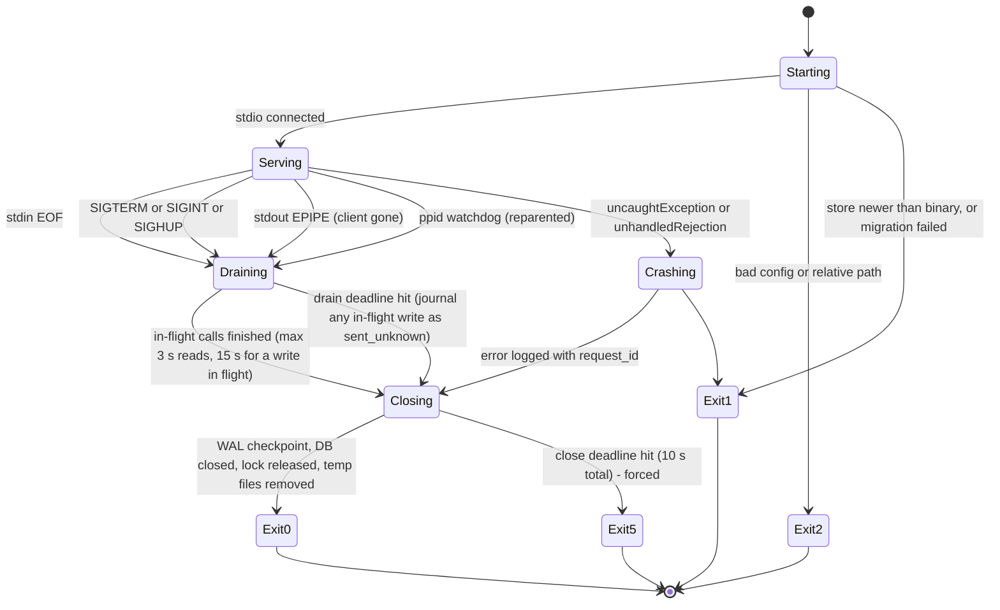

# 03 — Lifecycle and operations

**Author:** `architecture-planner-core` · **Date:** 2026-09-29 · **Brief:** `docs/scratch/briefs/architecture-planner-core.md`
**Inputs:** plan 01 (process model, store), plan 02 (auth, token store, gate); `docs/research/03-yahoo-api.md` §A; `02-prior-art-lessons.md` §3.5, §3.8, §4 #1; MCP specification 2026-07-28 *stdio* page (read 2026-09-29); Node.js `node:sqlite` docs (read 2026-09-29). Legend as in plan 01.
**Yahoo-dependency:** `read` — §2 auth UI, §5 online doctor rows 14–16, §6 token expiry, doctor #13. **`none`** — §1 lifecycle, ports, §3 config, §4 launch config, §7 migrations, §8 uninstall, doctor rows 1–12 and 19–22. *(tag added round 1, D.2 item 1: what survives a Yahoo denial is visible at a glance.)*

This plan exists because of four failures Chad has personally hit with local MCP servers (brief fact 10): **stdio disconnects without a clean process exit; port conflicts for auth/setup UIs; relative paths in launch config; token expiry mid-session with no recovery path.** Each has a named section, a mechanism, and a test in plan 05.

---

## 0. Decisions at a glance

| # | Decision | Why | Alternative considered | What would change it |
|---|---|---|---|---|
| L1 | **stdin EOF is the primary shutdown signal; SIGTERM/SIGINT/SIGHUP and stdout EPIPE are equivalent; a `ppid` watchdog catches the rest** | "Servers SHOULD exit promptly when their standard input is closed … the primary graceful-shutdown signal and the only portable one" [V-spec stdio "Shutdown"]; clients escalate SIGTERM → SIGKILL if we linger | rely on signals only | Nothing |
| L2 | **`serve` mode opens no listening socket, ever** | a stdio server has no reason to listen; every port conflict Chad hit came from a setup UI; the only listener is `ff auth --listener`, a separate short-lived process | in-process auth page | Streamable HTTP (plan 01 §3.2) |
| L3 | **The auth listener uses a fixed port and refuses to fall back** | the callback URL is registered on the Yahoo app and must match exactly [V-03 §A.1] — a fallback port would be a guaranteed `redirect_uri` mismatch; the honest behaviour is a precise error naming the process on the port and pointing at `ff auth` (oob) | fallback range | Yahoo allowing wildcard ports (not documented) |
| L4 | **Launch config always uses absolute paths, generated by `ff print-config`** from `process.execPath` and the resolved `dist/` path; secrets never in the snippet | GUI clients start with launchd's minimal `PATH` (no nvm/volta shims) **[A-1]**; relative paths resolve against the client's cwd [V-02 §4 #1] | `npx`/global bin in config | Nothing |
| L5 | **`ff doctor` runs offline by default and online with `--online`**; it never rotates a refresh token | a diagnostic must not change state; a rotation during `doctor` could race a running server | doctor performs a refresh | Nothing |
| L6 | **Token expiry mid-session is recovered without restarting the server**: proactive refresh 60 s early, refresh-once, `NOT_AUTHENTICATED` with a precise message, stale reads still served, and hot reload of the token file after `ff auth` in another terminal | brief fact 10 #4; [V-03 §A.2] | "restart Claude" | Nothing |
| L7 | **Forward-only, numbered SQLite migrations with an automatic, consistent pre-migration backup** — `sqlite.backup()` (v24 API) or `VACUUM INTO`, taken under the process-wide lock, never a file copy *(revised round 1, OBJ-10)*; a newer store refuses an older binary | journal and recommendation log are not rebuildable; cache is; under WAL a copy of `store.sqlite` alone is a torn snapshot (committed pages live in `-wal` until a checkpoint) and plan 01 §2 allows a second process to be writing | ORM migrations; `cp` | Nothing |
| L8 | **`ff uninstall` removes what we created and prints what it will not touch** (client config files, Yahoo consent) | the client config is the user's file; Yahoo consent can only be revoked at Yahoo | delete everything | Nothing |
| L9 | **The server's SQLite lock waits are bounded: `busy_timeout` 100 ms; cache writes are best-effort (a timeout is a miss), required writes retry ≤ 1 s then `STORE_BUSY`; refreshes write per-source dataset files published by atomic `rename()`, which the server attaches read-only and re-attaches on a version change — the store never takes a dataset write** (§1.1 step 3, §1.2; plan 01 §5.3/§5.5) *(added round 1, OBJ-11; layout revised round 2, OBJ-27)* | `node:sqlite` is synchronous, so every millisecond of lock wait is a millisecond the stdio loop is dead; the earlier 5 000 ms would have frozen a Sunday tool call behind a refresh, and round 1's staging-then-copy swap would have held the store's writer lock for the whole copy | `busy_timeout` 5 000 ms (the earlier draft); an async store API (none exists) | Node shipping an async `node:sqlite` API |

---

## 1. Process lifecycle

### 1.1 Startup (`ff serve`, the client's `command`)

Order matters: **nothing on the startup path touches the network**, because clients time out slow servers and a network stall would make the server look dead **[A-2: client startup timeouts exist but their values are unverified]**.

1. Parse args (`node:util.parseArgs`), read env (`FF_*`, `YAHOO_*`), resolve paths (`FF_CONFIG_DIR`, `FF_CACHE_DIR`, XDG, `~`). Fail fast with exit code 2 and a stderr line if `YAHOO_CLIENT_ID` is missing or a path is relative.
2. Install the shutdown handlers (§1.3) **before** anything can be half-open.
3. Open the store (`DatabaseSync`, WAL, **`busy_timeout` 100 ms** — the API is synchronous, so a lock wait blocks the stdio loop for the whole timeout; cache writes give up at once and count a miss, required writes retry in small steps for ≤ 1 s then surface `STORE_BUSY` — plan 01 §5.3, *revised round 1, OBJ-11: was 5 000 ms*), run migrations (§7) under an exclusive transaction; on a store from a newer version, exit 1 with the message; then `ATTACH` read-only every `<cache>/ds/<source>.sqlite` that `refresh_log` lists as current (a missing file = that dataset is "never loaded", plan 01 §5.5's `STALE_ONLY` hint) *(round 2, OBJ-27)*.
4. Load `tokens.json` (no network): derive the auth state (`NoTokens | Valid | Expired | NotProvisioned`) and the cached provisioning state.
5. Register tools from one fixed list (plan 01 §3.1) filtered by toolset — `FF_TOOLSET=core` (default: the 19 P0 tools) or `full` (plan 07 C3, *round 1*) — and by capability: write tools only if `FF_WRITE_ENABLED=1` and provisioning is `provisioned_read`/`provisioned_write` (plan 02 §3.4). Register resources and prompts.
6. `serveStdio(...)` (SDK v2, dual era). Log one `info` line: version, node, store path, auth state, tools registered.
7. Start the parent watchdog (§1.3) — a `setInterval(…, 5000).unref()` so it never keeps the loop alive on its own.

Total startup target: **< 300 ms** on a warm disk (a test asserts < 1 s without network).

### 1.2 Steady state

- Every tool call: `request_id`, start log line (`debug`), zod validation, domain call, envelope, end log line (`info`, `ms`, cache outcome). Long calls send `notifications/progress` only if the request carried a `progressToken` [V-spec progress is a request-scoped notification]; we do not depend on it.
- The event loop is never blocked for more than one SQLite statement **or 100 ms of lock wait** *(round 1, OBJ-11)*: dataset loads are the refresh process's job (plan 01 D8) and land in per-source dataset files the server attaches read-only, so nothing a refresh does touches `store.sqlite`'s writer lock; a version change is a `DETACH`/`ATTACH` on the next call (plan 01 §5.5, round 2 OBJ-27); the server's own writes are best-effort (caches) or bounded (`STORE_BUSY` after ≤ 1 s). A guard test asserts no `ff refresh` code path is reachable from `src/mcp`; plan 05 §2's latency test holds a 3-s writer lock and asserts p95 < 300 ms with zero errors.
- Two server processes (Desktop + Code) may coexist; they share the store (WAL) and the token file (lock + version rule, plan 02 §2.3).

### 1.3 Shutdown



Mechanisms:

| Trigger | Detection | Notes |
|---|---|---|
| stdin EOF | `process.stdin.on("end")` and `on("close")`; the SDK transport surfaces `onclose` — both are wired to the same `shutdown("stdin")` | the spec's primary signal [V-spec stdio] |
| SIGTERM / SIGINT / SIGHUP | `process.on(sig, …)` | the client's escalation path after closing stdin [V-spec stdio "Shutdown"] |
| stdout EPIPE | `process.stdout.on("error", e => e.code === "EPIPE" && shutdown("epipe"))` | writing to a dead client must not throw out of the transport |
| Parent death without EOF | watchdog every 5 s: `process.ppid !== initialPpid` (on macOS/Linux an orphan is reparented, typically to pid 1 / launchd) → `shutdown("orphaned")` | covers a client killed with SIGKILL where the pipe is inherited by something else and never closes **[A-3]**; `.unref()`'d so it never prevents exit |
| Crash | `uncaughtException` / `unhandledRejection` → log with stack (redacted) → `shutdown("crash")` with exit 1 | never `process.exit` inside a handler without the close sequence |

Shutdown is **idempotent and single-flight** (`shutdown()` returns the same promise on re-entry; a second SIGINT during draining forces the close deadline to now). Sequence: stop accepting (the transport's `close()`), wait for in-flight tool calls (reads ≤ 3 s; a Yahoo write already sent waits up to 15 s for its response — if the deadline passes, its journal row becomes `sent_unknown` for reconciliation, plan 02 §4.5), `PRAGMA wal_checkpoint(TRUNCATE)`, `db.close()`, release the token lock if this process holds it, delete this process's `*.tmp` files, flush stderr, `process.exit(code)`. Hard ceiling 10 s → exit 5.

**Exit codes** (shared with the CLI): `0` clean · `1` error · `2` usage/config · `3` not authenticated · `4` not provisioned · `5` forced shutdown after deadline.

### 1.4 No orphaned listeners

`serve` opens none (L2). `ff auth --listener` owns exactly one `https.Server` with: `server.close()` on success, on timeout (5 min), on `SIGINT`, and in a `finally`; `keepAliveTimeout` 1 s; the process exits after the callback is handled. A test (plan 05) starts the listener, kills the process with SIGINT, and asserts the port is free within 1 s.

---

## 2. Auth/setup UI: ports and the `oob` path

### 2.1 `oob` (default) — no listener

`ff auth` prints the URL, waits for the pasted code, exchanges it (plan 02 §2.1). No port, no certificate, no conflict. Timeout: the paste prompt waits 10 minutes, then exits 1 with "run `ff auth` again". This path is the answer to the port-conflict failure mode: **the default setup has no port to conflict**.

### 2.2 `--listener` (opt-in) — fixed port, no fallback

| Step | Behaviour |
|---|---|
| Port | `FF_AUTH_PORT` else **8765** [plan 02 A-2]. The registered callback is `https://localhost:<port>/callback`; the port is printed with the URL so the user can check it against the Yahoo app |
| Bind | `127.0.0.1` **and** `::1` (two servers, one handler) so `localhost` works whichever family the browser tries first **[A-4]** |
| Conflict | on `EADDRINUSE`: run `lsof -nP -iTCP:<port> -sTCP:LISTEN` (macOS/Linux; absent → skip) and print: `Port 8765 is in use by <command> (pid <n>). Either stop it or run 'ff auth' (no listener needed). This tool will not pick another port because the callback registered with Yahoo must match exactly.` Exit 2. **Never** silently choose another port (L3) |
| Certificate | `<config>/auth-cert/{key,cert}.pem`, 0600, generated once via the system `openssl` (plan 02 A-3); `--regen-cert` to replace; the browser warning is explained in the printed text |
| URL | printed exactly as the user must open it, plus the `state` (so a mismatch error is diagnosable) |
| Timeout | 5 minutes, then close + exit 1 with "run again" |
| One callback | the first request to `/callback` with a matching `state` is exchanged; every other path returns 404; after success the server closes |
| Errors from Yahoo | `error`/`error_description` query params are shown to the user and logged (redacted); `invalid_grant` gets the Yahoo troubleshooting hint ("callback area must match / be empty" [V-03 §A.1, §A.3]) |

### 2.3 Which one to recommend
`oob`, in the README and in `ff auth`'s own text. The listener stays for people who prefer a redirect and are willing to register the callback and accept a self-signed certificate.

---

## 3. Config precedence

`env` > `<config>/config.json` (optional, 0600 not required — no secrets allowed in it; `doctor` rejects a `client_secret` key there) > defaults. Keys: `YAHOO_CLIENT_ID` (required), `YAHOO_CLIENT_SECRET` | `YAHOO_CLIENT_SECRET_FILE`, `FF_CONFIG_DIR`, `FF_CACHE_DIR`, `FF_LEAGUE_KEYS`, `FF_WRITE_ENABLED`, `FF_TOOLSET` (`core` default | `full`; plan 07 C3), `FF_AUTH_PORT`, `FF_LOG_LEVEL`, `ODDS_API_KEY` (optional), `FF_WEATHER_SOURCE` (`open-meteo` | `nws`). Every key is documented once, in `src/config/schema.ts` (zod) from which the README table is generated (plan 04 §6).

---

## 4. Launch configuration (absolute paths, env, no secrets)

### 4.1 `ff print-config --client desktop`

Emits a JSON snippet with **resolved absolute paths** — `command` = `process.execPath` (the exact `node` binary that ran `ff`), `args[0]` = the absolute path of `dist/cli.js` resolved from `import.meta.url` — and env keys with placeholders for the values it must not know:

```json
{
  "mcpServers": {
    "fantasy-football": {
      "command": "/opt/homebrew/Cellar/node/24.x.y/bin/node",
      "args": ["/Users/<you>/Developer/yahoo-fantasy-football-mcp/dist/cli.js", "serve"],
      "env": {
        "YAHOO_CLIENT_ID": "<your client id>",
        "YAHOO_CLIENT_SECRET_FILE": "/Users/<you>/.config/fantasy-football-mcp/client_secret",
        "FF_LOG_LEVEL": "info"
      }
    }
  }
}
```

Paste target: `~/Library/Application Support/Claude/claude_desktop_config.json` (macOS) **[A-5: path from general knowledge; verify at build time]**. The client secret is referenced by file path, not value, so the client config carries no secret (plan 02 S2). `ff doctor` reads this file (if present), checks that `command` and `args[0]` are absolute and exist, that `command` is a Node ≥ 24.15 (plan 01 D2, round 1), and warns if the file's mode allows group/other read while `env` holds a `YAHOO_CLIENT_SECRET` value.

Version-manager note: `process.execPath` under nvm/volta/fnm points at a versioned binary that survives shell-less launches; that is the point of printing it rather than `node`.

### 4.2 `ff print-config --client code`

Emits the `claude mcp add` command line with the same absolute paths and `-e` env flags, **user scope** (`--scope user`) so no secret or absolute user path lands in the public repo's `.mcp.json` — when plan 10 D3 = yes the plugin's `.mcp.json` at the repo root exists by design and carries only `${CLAUDE_PLUGIN_ROOT}`/`${CLAUDE_PLUGIN_DATA}` variables (T7, round 1; plan 04 §1) **[A-6: flag syntax from general knowledge; verify against the Claude Code MCP docs at build time]**. `doctor` also parses Claude Code's user-level MCP config if found, with the same checks.

### 4.3 Global install variant
`npm install -g` puts `ff` on `PATH`; the config still uses the absolute `dist/cli.js` path printed by `ff print-config` — GUI clients do not have the user's shell `PATH` [A-1].

---

## 5. `ff doctor`

Offline checks run always; `--online` adds the network ones; `--fix` repairs mode bits and creates missing directories after a y/N prompt; `--json` for scripts (plan 06). Exit code = worst finding (0 ok, 1 fail, 2 config). Twenty-two rows: 1–18 as first written, 19–20 added for T9, 21–22 for OBJ-22 (round 1).

| # | Check | Pass condition | Fix / message |
|---|---|---|---|
| 1 | Node version | **≥ 24.15.0** — the line on which `node:sqlite` is a release candidate [V-node v24.x, 2026-09-30]; the v22 line is "active development" and prints `ExperimentalWarning` at every start (observed on 22.23.2, HANDOFF) *(revised round 1, OBJ-09)*. The message hedges the LTS label: "Node 24 (the LTS line per nodejs.org's schedule at build time — **[A-7]**)" | install/switch — Chad runs Node 22 via `fnm` today: `fnm install 24 && fnm use 24` (the README quickstart carries this line); the config's `command` must point at the 24 binary |
| 2 | Launch config paths | `command` and `args[0]` absolute, exist, executable; `command` is Node ≥ 24.15; `args` contains `serve` | prints the corrected snippet from `print-config` |
| 3 | Client config secrecy | no `YAHOO_CLIENT_SECRET` value in a client config that is group/other-readable | recommend `YAHOO_CLIENT_SECRET_FILE` |
| 4 | Config dir | exists, mode 0700, owned by the user | `--fix` chmods |
| 5 | Token file | exists, mode 0600, parses, `version` current; reports `expires_at`, `refreshed_at` age, `provisioning.state` + evidence | "run `ff auth`" (exit 3) |
| 6 | Client secret | env or file present; file mode 0600; not empty; no trailing newline (Yahoo's Basic-auth gotcha [V-03 §A.3]) | strip / chmod |
| 7 | Gate key | present and 0600 if any journal rows exist | regenerate (voids pending prepared writes — said explicitly) |
| 8 | Cache dir + store | writable; free space ≥ 1 GB; `PRAGMA quick_check` ok; schema version = binary's; size (warn > 500 MB); a `ds/<source>.sqlite` file present and `quick_check`-clean for every source `refresh_log` lists as current (round 2, OBJ-27) | `--fix` creates; `ff refresh` |
| 9 | Datasets | each `ds_*` last load age vs its hard limit (plan 01 §5.4) | `ff refresh <source>` |
| 10 | Pending journal | counts of `prepared`, `sent_unknown`; oldest age | `ff confirm --list`; reconciliation |
| 11 | launchd jobs | plists present in `~/Library/LaunchAgents/`, loaded (`launchctl print gui/$UID/<label>`), last exit status from `refresh_log` | `ff install-launchd` |
| 12 | `.npmrc` | `ignore-scripts=true`, `save-exact=true` when run from a checkout | — |
| 13 | Write flag | `FF_WRITE_ENABLED=1` only with provisioning ≥ `provisioned_read`; warns that write capability is unknown until the first write; **warns that writes are unsupported in a reach session** when (a) a Claude Code launch is detected (env `CLAUDECODE` or the client's `clientInfo.name` at connect — plan 02 S12, A-10) or (b) — a **heuristic** — the `claude_desktop_config.json` parsed by #2/#3 lists other `mcpServers` entries ("another MCP server may give the model file or shell access"; it cannot know what those servers do — plan 02 A-11), and prints the offered `permissions.deny` set for Claude Code (plan 02 §3.4) *(revised round 1, OBJ-01; round 2, OBJ-24)* | disable the flag, or apply the deny set and move the refresh token to the Keychain `SecretSource` (plan 02 §3.3) |
| 14 | *(online)* Clock skew | local time vs the `Date` header of an unauthenticated GET to the Yahoo API host (a 401 still carries `Date` [V-03 §B.6 probe]); warn > 60 s, fail > 300 s (token expiry math and HMAC TTLs depend on it) | fix the system clock |
| 15 | *(online)* Token validity | GET `users;use_login=1/games` with the current access token; if expired, one refresh under the lock (the same code path the server uses — not a second implementation); classify per plan 02 §3.2 | exit 3 / 4 with the exact message |
| 16 | *(online)* Provisioning | from #15: `provisioned_read`, or `not_provisioned` with the application URL | — |
| 17 | *(online)* Sources | `HEAD`/`GET timestamp.txt` for each nflverse release, Sleeper `state/nfl`, RSS heads — reachability only | — |
| 18 | *(listener only)* `openssl` present; port free (`--listener`) | — | see §2.2 |
| 19 | Scoring mismatch *(T9, round 1)* | no open `scoring_mismatch` row (offline: read from `league_settings` / `refresh_log`); if open, lists the affected player-weeks and whether it has escalated to `scoring_mismatch_league` (> 10 % — plan 08 §6.3) | re-run `onboard`'s self-check; the fix is a pattern-table row or a fixture (plan 08 §6 step 3) |
| 20 | Settings changed *(T9, round 1)* | no unacknowledged `settings_changed` row (a new `settings_hash` since the last analytics call) | `ff refresh --settings`; projections re-score on read |
| 21 | Stale build *(round 1, OBJ-22)* | when run from a checkout: `dist/cli.js` mtime is newer than every `src/**` file and `package.json` | "run `npm run build` — the client is launching an old `dist/`" (after `git pull` without a build the client runs yesterday's server) |
| 22 | Client MCP log tail *(round 1, OBJ-22)* | reads the last 50 lines of the client's log for this server — Claude Desktop `~/Library/Logs/Claude/mcp-server-<name>.log` **[A-8: path from general knowledge; verify at build time]**, Claude Code per its docs at build time, or `--client-log <path>` — and reports the last exit reason / stderr lines, so "what happened last time" (the stdio-disconnect failure mode, brief fact 10) is answered without opening the file | the reported line names the fix (`ff auth`, `npm run build`, a relative path …) |

---

## 6. Token expiry mid-session (recovery without restart)

| Moment | Behaviour | What the user sees |
|---|---|---|
| Access token within 60 s of `expires_at` at call time | refresh under the lock before the Yahoo call (one round trip) | nothing |
| Yahoo returns `401 token_rejected` | refresh once, retry once (plan 02 §3.1) | nothing, or a `warnings[]` line if the refresh took > 2 s |
| Refresh fails with `invalid_grant` | auth state → `NoTokens`; `refreshFailedAt` set (no further refresh attempts for 5 min); the tool returns **data from cache if within the hard limit** with `freshness: "stale"` and a warning, else `NOT_AUTHENTICATED` | `"Your Yahoo session could not be refreshed (Yahoo: invalid_grant — this happens after a password change or if the app was revoked). In a terminal run: ff auth — then retry here; this chat can continue."` |
| User runs `ff auth` in another terminal | the CLI writes a new `tokens.json` (new `version`); the running server checks the file's `version`/mtime on the next call and **reloads** (plan 02 §2.3) | the next tool call just works |
| `401 additional_authorization_required` / `403` | provisioning → `not_provisioned` (terminal); write tools unregistered; no further Yahoo calls | `"This Yahoo app is not provisioned for the Fantasy API. Apply at sports.yahoo.com/developer/access; run ff auth --recheck after approval."` |
| Server crash during refresh | the temp+rename write means `tokens.json` is either old or new, never torn; if Yahoo rotated and we lost the new token, the next refresh gets `invalid_grant` → the row above | one re-auth |

The server process never exits on an auth problem; auth problems are tool results, not crashes (brief fact 10 #4).

---

## 7. Upgrade and migration

- **Store:** `schema_version(version INTEGER, applied_at)`; migrations `src/store/migrations/NNN_<name>.ts` export `up(db)` only (forward-only); applied in order inside `BEGIN IMMEDIATE`; before the first pending migration, take a **consistent** backup to `store.sqlite.bak-v<old>` with `sqlite.backup(db, path)` (the v24 API, returns a Promise — plan 01 D4) or `VACUUM INTO` (what plan 06 §1.2's `store backup` job already uses), **while holding the process-wide lock** (the token-lock pattern, plan 02 §3.3) so a second server process cannot write mid-backup *(revised round 1, OBJ-10 — a `cp` of a WAL database is a torn snapshot)*; a test restores from the backup and asserts the journal and recommendation-log row counts (plan 05 §2 `store`). Cache is rebuildable, the journal and recommendation log are not. Prune backups older than the last two versions. A store with `version > binary's` → exit 1: `"store.sqlite was written by a newer version (v7); this binary supports v5. Upgrade the package or restore the backup."` Dataset table changes bump `ds_schema`; a dataset file is **never migrated in place** — the next `ff refresh` writes a new file from the last downloaded release file if still present, else re-downloads (round 2, OBJ-27).
- **Token file:** `version` field; `src/auth/token-upgrade.ts` migrates older shapes in memory and rewrites atomically on the next write.
- **Config:** additive only; unknown keys warn, never fail.
- **Package upgrade path:** `git pull && npm ci && npm run build` (checkout install) or `npm update -g fantasy-football-mcp` (global); the launch config does not change because `dist/cli.js` keeps its path; `ff doctor` after every upgrade (plan 06 pre-release check runs it in CI against a fresh store).
- **Node upgrade path (quickstart note, round 1 OBJ-09):** the floor is 24.15 (plan 01 D2). Under `fnm`: `fnm install 24 && fnm use 24`, then re-run `ff print-config` so the launch config's `command` points at the 24 binary (`process.execPath` changes with the version — §4.1).
- **SDK/protocol upgrades:** re-read `docs/protocol-versions.md` [V-sdk] on every SDK bump; the Inspector smoke (plan 05 §5) runs against both eras.

---

## 8. Uninstall and cleanup

`ff uninstall` (interactive; `--yes` for scripts):
1. `launchctl bootout gui/$UID/<label>` for each of our plists and delete them from `~/Library/LaunchAgents/`.
2. Delete `~/.cache/fantasy-football-mcp/` (store, `ds/` dataset files, temp downloads) — asks first because the journal and recommendation log live there; offers `--export-journal <path>` (JSON) before deletion.
3. Ask before deleting `~/.config/fantasy-football-mcp/` (tokens, gate key, client secret file, auth cert — there is no pending-confirmation file; plan 02 §4.2 channel 2 keeps the code only in the notification and its hash in the store).
4. Print, and do **not** edit: the `mcpServers.fantasy-football` entry to remove from the Claude Desktop config; the `claude mcp remove fantasy-football` command; the Yahoo account page where the app's consent can be revoked (revocation is only possible at Yahoo [V-03 §A.2]); a note that Time Machine may hold copies of the token file.
5. `npm uninstall -g fantasy-football-mcp` if globally installed (printed, not run).

---

## 9. What this plan does not decide
Which refresh jobs exist and their schedules (plan 06 — this plan only specifies that `serve` runs none); the CI that keeps `doctor` honest (plan 04); tests for every row above (plan 05 §4).

---

## 10. Assumptions and unverified, by name

| # | Assumption | Verify by |
|---|---|---|
| A-1 | Claude Desktop launches servers with launchd's minimal `PATH` (no shell init), so `node` must be absolute | it is the standing failure mode (brief fact 10); confirmed by a Desktop smoke with a config that uses bare `node` |
| A-2 | Clients impose a startup timeout on stdio servers | keep startup network-free regardless |
| A-3 | An orphaned server sees `process.ppid` change | a test spawns the server from a child that is SIGKILLed and asserts the server exits within 10 s |
| A-4 | Binding both `127.0.0.1` and `::1` is needed for `localhost` callbacks | try with a browser; if Yahoo accepts `https://127.0.0.1:port` the IPv6 bind is unnecessary (03 §F.3) |
| A-5 | Claude Desktop config path on macOS | verify at build time; `doctor` also accepts `--client-config <path>` |
| A-6 | `claude mcp add --scope user … -e K=V -- cmd args` syntax | Claude Code MCP docs at build time |
| A-7 | Node 24 is the current LTS line as of 2026-09 — stays [U]; doctor #1's text is hedged accordingly *(round 1, OBJ-23 d)* | nodejs.org release schedule at build time |
| A-8 | Claude Desktop writes a per-server MCP log at `~/Library/Logs/Claude/mcp-server-<name>.log` (doctor #22) *(added round 1, OBJ-22)* | look on Chad's Mac at build time; `--client-log <path>` is the fallback either way |
