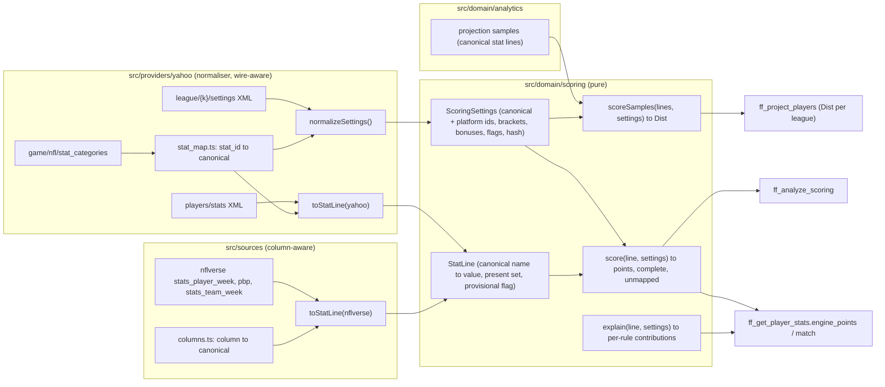

# 08 — Scoring engine (format-aware, pure, self-checking)

**Author:** `product-planner` · **Date:** 2026-09-29 · **Brief:** `docs/scratch/briefs/product-planner.md`
**Inputs (cited, not restated):** plan 01 §1.1 (module map), §5.2 (settings cache row), §8 (seam: `ScoringSettings`, `stat_map.ts`), §8.1 (placement, memo, golden fixture paths); plan 05 §2 (`domain/scoring` assertions), §7 (100 % coverage module); plan 07 (tools that call the engine: A2, B2, E1, E15); `docs/research/05-strategy-and-analytics.md` §15 (the spec this plan implements), §1 step 9 and §19.1 (projections through the engine), §8 (K/DST models); `03-yahoo-api.md` §B.5 (stat ids; the official sample's 36 ids), §B.6 (scalars are strings), §D.2 (provisional weeks), §F.8 (bonus wire form [U]); `04-data-sources.md` B1 (`stats_player_week` columns), B2 (ffopportunity), A #5 (RZ/GL derivation).

**Legend** as in plan 01: **[V-05 §x]** etc. cite the research; **[A-n]** assumed (listed in §11); **[U]** unverified, needs a live token or the first golden run.

---

## 0. Decisions at a glance

| # | Decision | Why | Alternative considered | What would change it |
|---|---|---|---|---|
| E1 | **The engine is a pure module `src/domain/scoring/` with three functions — `score`, `scoreSamples`, `explain` — and no I/O, no platform types** | plan 01 §1.1 boundary; plan 05 §7 makes it a 100 %-coverage module; 05 §19.1 needs one engine for any league | scoring inside the provider | nothing |
| E2 | **Canonical stat names are the hub**: every platform stat id and every external column maps *to* a canonical name; the engine scores canonical `StatLine`s against a normalised `ScoringSettings` whose rules are keyed by canonical name **and** platform id | one projection (stored canonically, 05 §19.1) serves any league; ESPN later maps to the same hub (plan 01 §8); unmapped ids stay visible | score directly on Yahoo `stat_id`s | nothing — the hub is what makes the ESPN seam a table, not a rewrite |
| E3 | **Bracket families and bonuses are data derived from the settings, never hard-coded ids** | 05 §15 "never hard-code ids"; 05 §17.18; Yahoo's DST yards-allowed and bonus ids are [U] (03 §F.8) | a constant table of known ids | nothing; the checked-in Yahoo table (§3.1) is a *seed* for name matching, not the source of truth |
| E4 | **Rounding and the negative-points floor are computed only after the golden test has verified Yahoo's rule; until then the engine computes exact values and reports the flag as unverified** | 05 §15: "never guess a rounding mode"; both flags are [U] | assume round-half-up per stat | the first golden run with a `uses_fractional_points = 0` or `uses_negative_points = 0` league fixes the rule in `rounding.ts` with a fixture |
| E5 | **Projections flow through the engine as sampled stat lines** (`scoreSamples`), never as scaled means | 05 §1 step 9, §15 "projection scoring": bonuses and brackets make `E[points]` non-linear | score the mean line, scale a CV | nothing |
| E6 | **The golden test is a gate, not a tolerance**: every rostered player-week in the fixtures must match `player_points.total` within 0.01. A **live** mismatch marks the league's settings dirty and **degrades locally**: `engine_complete: false` and a `warnings[]` line for the affected players only, with analytics falling back to Yahoo `player_points` for those players where a final week exists; a **league-wide block only when > 10 % of rostered player-weeks mismatch** (the signature of a settings change, not a stat correction) *(revised round 1, OBJ-17: the earlier "blocks downstream analytics until explained" failed the whole product closed for one player's 0.5-point discrepancy)* | 05 §15 "a bug to fix, not tolerance to widen"; plan 01 §5.2 invalidation row; for a single-user tool the right failure is local | tolerate small mismatches; block everything (the earlier draft) | nothing |
| E7 | **Normalised settings are memoised by `settings_hash`; projections are stored format-agnostically and scored per league on demand** | plan 01 §8.1; 05 §19.1 | pre-scored projections per league | nothing |

---

## 1. Where the engine sits



Reading the arrows: nothing in `src/domain/scoring` knows a Yahoo `stat_id` is Yahoo's — the platform id travels inside `ScoringSettings.rules[].platform_id` as opaque data so `explain` can report it. The two `toStatLine` translators are the only places that know column and element names (plan 01 §1 "the domain never imports a wire type").

---

## 2. Types (the contract the tools and tests share)

```ts
// src/domain/scoring/types.ts
export type Canonical = string;                 // "pass_yd", "rec", "fg_40_49", "dst_pa_7_13", …  (§3.1 registry)
export type PositionType = "O" | "K" | "DT" | "D";

export interface ScoringRule {
  canonical: Canonical | null;                  // null = the platform id could not be mapped (unmapped, logged once)
  platform_id: string;                          // Yahoo stat_id as string; ESPN id later
  name: string;                                 // platform display name (untrusted for output; used for family derivation)
  position_types: PositionType[];               // from stat_position_types; a rule applies only to these
  modifier: number | null;                      // null = display-only (present in categories, absent from modifiers) → 0
  bonuses: { target: number; points: number }[];// threshold bonuses on this stat (05 §15)
}
export interface BracketFamily {
  family: "dst_points_allowed" | "dst_yards_allowed" | "fg_distance" | string; // derived from names (§4.1)
  position_type: PositionType;
  members: { canonical: Canonical; platform_id: string; lower: number; upper: number | null }[]; // mutually exclusive, ordered
  exclusive: true;                              // exactly one member indicator is 1 per game when the family is complete
}
export interface ScoringSettings {
  platform: "yahoo" | "espn";
  rules: ScoringRule[];
  brackets: BracketFamily[];
  uses_fractional_points: boolean;
  uses_negative_points: boolean;
  rounding: { mode: "exact" | "round_half_up_total" | "floor_total" | string; verified: boolean }; // E4
  negative_floor: { scope: "none" | "player_week_total" | string; verified: boolean };            // E4
  settings_hash: string;                        // sha256 of the canonical JSON of everything above except `verified` flags
}
export interface StatLine {
  values: Record<Canonical, number>;            // only stats that were present
  present: Set<Canonical>;                      // distinguishes 0 from "not reported"
  position_type: PositionType;                  // the player's type in this league (O, K, DT)
  provisional: boolean;                         // 03 §D.2 week not yet final
  source: string;                               // "yahoo", "nflverse", "projection:v2", …
}
export interface ScoreResult {
  points: number;                               // after rounding/floor rules when verified; exact otherwise
  points_exact: number;
  complete: boolean;                            // false if provisional AND any rule's stat is absent
  unmapped: string[];                           // platform ids in settings with canonical=null (reported once per settings_hash)
  ignored: Canonical[];                         // stats in the line not in the settings
  contributions: { canonical: Canonical; value: number; modifier: number; points: number; kind: "linear" | "bracket" | "bonus" }[];
}
```

`score(line, settings): ScoreResult`, `scoreSamples(lines: StatLine[], settings, basis: "position_cv" | "player_sim"): { dist: Dist; mean_of_exact: number; bonus_probability: Record<Canonical, number>; bracket_probability: Record<string, number[]> }`, `explain = score` with `contributions` rendered (it is the same call; named for the tools). `basis` is supplied by the caller — `position_cv` for v1's parametric samples drawn from a position CV table, `player_sim` for v2's simulated stat lines — and is copied onto `Dist.basis` unchanged so every interval downstream says where its width came from (plan 07 legend, round 1 OBJ-04).

---

## 3. Mapping strategy

### 3.1 Canonical registry and the Yahoo table (`src/providers/yahoo/stat_map.ts`)

The registry is one checked-in table with, per canonical name: position type, the Yahoo id from the official sample (03 §B.5), a **name-matching pattern** used against `game/nfl/stat_categories` so ids outside the sample resolve by name, and the nflverse expression (§3.2). The sample's 36 ids are seeded; anything else is learned by pattern at `normalizeSettings` time and persisted with the settings (so a league that enables "Rushing 1st Downs" (`81`) resolves on first read).

| Canonical | Pos | Yahoo id (sample) | Name pattern (case-insensitive) | Note |
|---|---|---|---|---|
| `pass_yd`, `pass_td`, `pass_int` | O | 4, 5, 6 | `^passing yards$`, `^passing touchdowns$`, `^interceptions$` (position_type O) | `6` vs `33` are both "Interceptions" — position type disambiguates (05 §15) |
| `rush_att`, `rush_yd`, `rush_td` | O | 8, 9, 10 | `^rushing (attempts\|yards\|touchdowns)$` | 8 display-only in the sample |
| `targets`, `rec`, `rec_yd`, `rec_td` | O | 78, 11, 12, 13 | `^targets$`, `^receptions$`, `^receiving (yards\|touchdowns)$` | |
| `ret_td_off` | O | 15 | `^return touchdowns$` (O) | offensive players' return TDs |
| `two_pt` | O | 16 | `^2-point conversions$` | whether pass/rush/rec 2-pt all count under 16 [U-1] |
| `fum_lost` | O | 18 | `^fumbles lost$` | a total-fumbles id exists [U-2]; pattern `^fumbles$` → `fum` |
| `off_fum_ret_td` | O | 57 | `^offensive fumble return td$` | |
| `fg_0_19` … `fg_50p` | K | 19–23 | `^field goals (\d+)-(\d+) yards$`, `^field goals (\d+)\+ yards$` | bracket family `fg_distance` (§4.1) |
| `fg_miss_*`, `pat_miss` | K | [U-3] | `^field goals missed` … | present in the universe per 05 §15 |
| `pat_made` | K | 29 | `^point after attempt made$` | |
| `dst_pa` (display), `dst_pa_0`, `dst_pa_1_6`, `dst_pa_7_13`, `dst_pa_14_20`, `dst_pa_21_27`, `dst_pa_28_34`, `dst_pa_35p` | DT | 31; 50–56 | `^points allowed$`; `^points allowed (\d+)$`, `^points allowed (\d+)-(\d+)$`, `^points allowed (\d+)\+$` | bracket family `dst_points_allowed` |
| `dst_ya_*` | DT | [U-4] | `^yards allowed …` | bracket family `dst_yards_allowed`, same mechanism |
| `dst_sack`, `dst_int`, `dst_fum_rec`, `dst_td`, `dst_safety`, `dst_blk`, `dst_ret_td`, `dst_xpr` | DT | 32, 33, 34, 35, 36, 37, 49, 82 | `^sack$`, `^interception$`, `^fumble recovery$`, `^touchdown$`, `^safety$`, `^block kick$`, `^kickoff and punt return touchdowns$`, `^extra point returned$` | all DT |
| `rush_1d`, `rec_1d`, `pass_1d`, yardage-bonus ids, IDP ids | O/D | [U-5] | learned by pattern | IDP (`D`) is out of scope for analytics but must still *score* if a league enables it — unmapped ids are logged, never fatal |

Rules: a rule whose id matches no pattern gets `canonical: null` and appears in `ScoreResult.unmapped` (logged once per `settings_hash`, plan 01 §8 "ignored, but logged once"); `ff_get_league.scoring.unmapped_stat_ids[]` exposes it; the onboarding Skill (plan 09) reports it. Two rules mapping to the same canonical name in one position type is a normaliser error (fail loudly — it means the pattern table is wrong).

### 3.2 External stat → canonical (`src/sources/nflverse/columns.ts`; the loader's schema assertion is the verification, plan 01 §5.5)

| Canonical | nflverse `stats_player_week` expression [A-1 on exact column names — asserted at load] | Fallback / derivation |
|---|---|---|
| `pass_yd`, `pass_td`, `pass_int` | `passing_yards`, `passing_tds`, `passing_interceptions` | — |
| `rush_att`, `rush_yd`, `rush_td` | `carries`, `rushing_yards`, `rushing_tds` | — |
| `targets`, `rec`, `rec_yd`, `rec_td` | `targets`, `receptions`, `receiving_yards`, `receiving_tds` | — |
| `two_pt` | `passing_2pt_conversions + rushing_2pt_conversions + receiving_2pt_conversions` | [U-1] decides whether the sum is right |
| `fum_lost` | `sack_fumbles_lost + rushing_fumbles_lost + receiving_fumbles_lost` | — |
| `ret_td_off` | `special_teams_tds` (player level) | pbp `td_player_id` on `play_type in (kickoff, punt)` |
| `off_fum_ret_td` | pbp: fumble recovery TD by an offensive player | rare; 0 when pbp absent (`present` false) |
| `fg_0_19` … `fg_50p` | `fg_made_0_19`, `fg_made_20_29`, `fg_made_30_39`, `fg_made_40_49`, `fg_made_50_59 + fg_made_60_` | pbp `kick_distance` binned to the *league's* bracket bounds (§4.1) — the primary path when the league's bins differ from nflverse's |
| `fg_miss_*`, `pat_made`, `pat_miss` | `fg_missed_*`, `pat_made`, `pat_missed` | pbp |
| `dst_pa_*` | derived: opponent points allowed → the league's bracket (§4.1) | **definition [U-6]**: (a) opponent final score, or (b) opponent score minus points scored on defensive/special-teams returns against the offence (pick-six, fumble return, punt/kick return TDs). Both derivations are implemented; the golden test selects one per platform and the choice is pinned with a fixture |
| `dst_sack`, `dst_int`, `dst_fum_rec`, `dst_td`, `dst_safety`, `dst_blk`, `dst_ret_td`, `dst_xpr` | `stats_team_week` (team = defence): `def_sacks`, `def_interceptions`, `def_fumbles_recovered`, `def_tds`, `def_safeties`, blocked kicks and `dst_xpr` from pbp | — |
| `dst_ya_*` | derived: opponent total yards → league bracket | — |

The projection layer (05 §1) produces canonical stat lines directly, so no third mapping exists. ffopportunity's `*_exp` columns feed the *projection*, not the engine (05 §1 step 5).

**`toStatLine(nflverse)` is the Phase-1 path** *(revised round 1, OBJ-03)*: v1 projections (plan 07 E1 `v1-trailing`) are built from nflverse `stats_player_week` lines scored by this engine, so the projection/start-sit/K-DEF chain needs no Yahoo access (plan 10 Phase 1a). `toStatLine(yahoo)` feeds the golden check (§6) and `ff_get_player_stats.match` only. Both translators must agree on a shared week: a test scores the same player-week through both paths and asserts `|Δ| ≤ 0.01` wherever the two sources report the same stats — a cheap cross-check that the nflverse column map (§3.2, A-1) is right before the Yahoo golden gate exists.

### 3.3 Position-type gating

A rule applies only to lines whose `position_type` is in `rule.position_types` (05 §15 "a DEF touchdown is stat 35 (DT), not 13 (O)"). A player's *slot* never changes his scoring (an RB in `W/R/T` scores as `O`). Team defences are `DT`; kickers `K`; IDP `D`. The gate is part of `score`, not of the translators, so a mis-typed line fails a property test rather than silently scoring.

---

## 4. Families that need more than multiplication (05 §15 table, made mechanical)

### 4.1 Bracket families

- **Derivation.** `normalizeSettings` groups rules by `(position_type, family key)` where the family key comes from the name pattern (`points allowed`, `yards allowed`, `field goals … yards`). Bounds are parsed from the name: `(\d+)` → `[n, n]`, `(\d+)-(\d+)` → `[a, b]`, `(\d+)\+` → `[n, null]`. Members are sorted by `lower`; the normaliser asserts contiguity and no overlap; a gap or overlap is a **normaliser error with the offending names** (never a silent skip).
- **Scoring a stat line.** The Yahoo stat line already carries the indicators (exactly one of 50–56 is `1`); the engine multiplies as usual **and** asserts exclusivity (`Σ members ≤ 1`); if the sum is 0 on a final week for a `DT` line, the game is treated as not played (`present` false for the family) — never as "0 points allowed" (05 §15 adversarial: "a DST with 0 points allowed (bracket 50 = 10)").
- **Scoring a derived line** (nflverse, projection samples): the translator emits the *scalar* (`dst_pa = 17`) and the engine's `bracketize(family, scalar)` sets the indicator — so external lines never have to know the league's bins.
- **Expectation.** `E[family] = Σ_m P(scalar ∈ m) × modifier_m`, with `P` from the samples (`scoreSamples`) or, for K/DST models, from the distribution 05 §8 specifies (negative binomial around the opponent's implied total).
- **FG distance** is the same mechanism with `kick_distance` as the scalar (`fg_distance` family), which is why a league with `0–29 / 30–39 / 40+` bins needs no code change.

### 4.2 Bonuses

`rule.bonuses[]` — `points × [value ≥ target]` per entry, summed; multiple entries on one stat sum (05 §15). Wire form [U] (03 §F.8): the Yahoo normaliser reads `bonuses[{target, points}]` on a `stat_category` when present **and** treats an extra stat id whose name matches `^(\d+)\+ (passing|rushing|receiving) yards bonus$`-style patterns as a bonus rule on the base stat (both forms produce the same `ScoringRule.bonuses` entry). `E[bonus] = P(stat ≥ target) × points` from samples — never `[E[stat] ≥ target] × points` (05 §1 format sensitivity: "the one format where scale-the-mean is simply wrong").

### 4.3 Fumbles, 2-pt, return TDs, XPR, offensive fumble-return TD

Plain modifiers. The engine never assumes which fumble stat a league uses (`fum_lost` vs `fum`, [U-2]); both canonical names exist and the settings decide. Return TDs by offensive players count under `ret_td_off` (O, id 15); by the defence under `dst_ret_td` (DT, id 49); the gate in §3.3 keeps them apart even when a player line and a DST line are scored in one batch.

### 4.4 Negative totals and rounding (E4)

- `uses_negative_points = 0` → floor the **player-week total** at 0 [A-2, per 05 §15 "this floor level is an assumption"]; scope is a setting field `negative_floor.scope` so a per-stat floor can be switched on by a fixture if the golden test says so.
- `uses_fractional_points = 0` → `rounding.mode` is `"exact"` with `verified: false` until a golden fixture from such a league exists; `ff_get_league` reports `rounding: unverified` and `ff_get_player_stats.match` will be `null` (not `false`) for that league so the mismatch is not mistaken for a bug. The validation league uses fractional points, so v1 ships with this branch untested by design and says so.
- With fractional points: exact arithmetic on decimal modifiers (`0.04 × 312`) can produce binary-float noise; `points_exact` is rounded to 2 dp *for comparison only* (`|Δ| ≤ 0.01`), never stored rounded.

### 4.5 Missing and unknown categories

- Category in settings, absent from the line: `0`, and `complete = false` **only if** `line.provisional` (03 §D.2); on a final week absence is a true zero (bye, DNP).
- Stat in the line, absent from settings: ignored, listed in `ignored[]` (never logged per call — `unmapped` is the logged one, once per `settings_hash`).
- Yahoo scalars arrive as strings and empties (03 §B.6): the translator coerces `"112.82"` → `112.82`, `""`/missing → not present. Property test: no `NaN` ever reaches `score`.

---

## 5. Recomputing any player's points and projections under the exact settings

| Need | Call | Used by (plan 07) |
|---|---|---|
| Points for a Yahoo stat line | `score(toStatLine(yahooLine), settings)` | B2 (`engine_points`, `match`), E13 (realised points), golden test |
| Points for an nflverse line (a non-rostered player, a past season for backtests) | `score(toStatLine(nflverseRow), settings)` | E1 v1 (trailing lines), E5 (`points_league` in D1), backtests (05 §12) |
| What-if under variants | `score(line, applyOverrides(settings, overrides))` | E15 |
| A projection's distribution under this league | `scoreSamples(samples, settings)` → `Dist` | E1, E2–E9 (every `Dist` in the catalog) |
| Which rules produced the points | `explain` (= `contributions[]`) | B2 mismatch diagnostics, onboarding report |

A projection is stored **once** per `(gsis_id, season, week, model_version)` as `{ expectation: Record<Canonical, number>, samples: StatLine[n_sims] }` (compressed; canonical names only) and scored per league at read time (E7). `Dist` quantiles come from the scored samples; `mean_of_exact` is the linear part plus expected bonus/bracket terms and must equal the sample mean within Monte-Carlo error (a property test with `n_sims ≥ 4000` asserts `|Δ| < 0.5 pt`).

---

## 6. Validation — the self-check against Yahoo (05 §15 "one call away")

1. **Golden fixtures (CI, zero credentials).** Paths fixed by plan 01 §8.1: `fixtures/yahoo/league-settings/461.l.1000.xml` + `fixtures/yahoo/player-week-stats/461.l.1000-week-<N>.xml` (≥ 3 weeks, every rostered player of every team, recorded and scrubbed per plan 05 §3.1). `tests/domain/scoring/golden.test.ts` asserts `|engine − player_points.total| ≤ 0.01` for **every** player-week, and that `complete = true` on final weeks. Expected outputs are also frozen under `fixtures/golden/` with a manifest hash (plan 05 §3.1 step 3) so an engine change that silently alters a score fails even if the Yahoo fixture is unchanged.
2. **Live self-check, on demand.** `ff_get_player_stats.match` (plan 07 B2); the onboarding Skill runs it on 3 players × 2 weeks; `ff smoke` (plan 05 §5) scores one roster week.
3. **Mismatch procedure (E6; revised round 1, OBJ-17).** On any `match: false` on a final week: (a) the provider marks the league's settings cache dirty (plan 01 §5.2 invalidation trigger); (b) `explain` output for that player-week is written to the stderr log with `settings_hash` and the per-rule diff; (c) `ff_get_status.checks[]` gets a row `scoring_mismatch` listing the affected player-weeks; every analytics tool adds a `warnings[]` line **naming those players** and, for them only, uses Yahoo `player_points` where a final week exists and `engine_complete: false` otherwise — **local degradation, not a product-wide stop**: one commissioner enabling `rush_1d` mid-season, one late Yahoo stat correction, or one unresolved [U-1]/[U-6] semantic on one player-week must not stop lineup advice for the fifteen other players; (c′) when the mismatch rate exceeds **10 % of rostered player-weeks** in the affected week — a settings change rather than a correction — the row escalates to `scoring_mismatch_league` and every analytics tool returns `rec.no_move: true` with the warning until settings are re-fetched and the golden re-run; (d) the fix is a table row (pattern, canonical) or a fixture — never a tolerance change. The 10 % threshold is a constant in `src/domain/scoring/policy.ts` **[A-5]**. Diagnostics classify the mismatch: `unmapped_id` (an id in `unmapped[]` carries points), `bracket_bounds` (a family's members sum to 0 or > 1), `flag_semantics` (rounding/floor), `translator` (a Yahoo value that did not coerce).
4. **What a passing golden proves and what it does not.** It proves the engine reproduces Yahoo *for the settings in the fixtures*. It does not exercise `uses_fractional_points = 0`, `uses_negative_points = 0`, yardage bonuses, or DST yards-allowed unless a second fixture league with those settings is recorded (plan 10 lists it as a P1 task, credentialed). Those branches are property-tested for *internal* consistency and flagged `verified: false` in the settings until then (E4).

---

## 7. Property-test invariants (`tests/property/scoring.test.ts`, fast-check; plan 05 T2)

| # | Property | Generator |
|---|---|---|
| P1 | **Linearity in stats** outside brackets/bonuses: `score(a·x + b·y) = a·score(x) + b·score(y)` for lines restricted to linear rules | random settings (modifiers in [−10, 10], 0–3 dp), random lines |
| P2 | **Homogeneity in a modifier**: perturb one modifier by δ → total moves by exactly `δ × value` (05 §15 mutation test) | random rule, δ ∈ [−5, 5] |
| P3 | **Bracket exclusivity**: for any scalar, `bracketize` sets exactly one member; removing one member row changes only lines whose scalar falls in that member (05 §15) | random contiguous families |
| P4 | **Bonus monotonicity**: `score` is non-decreasing in a stat that carries only positive bonuses; `E[bonus]` from samples equals `P(stat ≥ target) × points` within MC error | random targets/points |
| P5 | **Position-type gating**: a stat counted under `O` never counts under `DT` and vice versa; a line with `position_type` outside a rule's set contributes 0 for that rule | lines with both O and DT stats |
| P6 | **Unmapped/ignored**: adding an unknown platform id to settings changes no score and appears in `unmapped[]` once; adding an unknown canonical to a line changes no score and appears in `ignored[]` | random extra ids |
| P7 | **Normaliser idempotence and hash stability**: `normalize(normalize(s)) = normalize(s)`; reordering `stat_modifiers` or `stat_categories` does not change `settings_hash`; changing any modifier does | permutations |
| P8 | **Rounding bounded**: with `rounding.mode = exact`, `points = points_exact`; with any verified mode, `|points − points_exact| ≤ 0.5` and `points` is integral | — |
| P9 | **Negative floor**: with `uses_negative_points = false` and scope `player_week_total`, `points ≥ 0` and `points = max(0, points_exact)`; with `true`, `points = points_exact` | lines with negative modifiers |
| P10 | **Complete flag**: `complete = false` ⇔ `provisional ∧ ∃ rule with modifier ≠ null whose canonical ∉ present`; never false on a final week | random `present` sets |
| P11 | **No NaN/Infinity** ever leaves `score` for any coercible Yahoo scalar (`""`, `"0"`, `"112.82"`, `" 3 "`, `"1e2"` [rejected as not present]) | string generator |
| P12 | **Determinism**: same inputs → byte-identical `ScoreResult`; `scoreSamples` with a fixed seed is reproducible | — |
| P13 | **Sample-mean consistency**: `scoreSamples(...).dist.mean ≈ mean_of_exact` within `3σ/√n` | random projection samples |
| P14 | **Platform round trip** (ESPN seam readiness): a canonical line scored under a Yahoo `ScoringSettings` and under an ESPN `ScoringSettings` built from the same *canonical* rule set gives identical points | the two normalisers over one canonical rule table |

---

## 8. Edge-case catalogue (each is a named fixture in `fixtures/golden/edge/` and a test)

| Case | Expected behaviour | Source |
|---|---|---|
| Empty stat line, final week | `points = 0`, `complete = true`, no contributions | 05 §15 |
| Empty stat line, provisional week | `points = 0`, `complete = false` | 03 §D.2 |
| Unknown stat ids in the line | ignored; listed; no throw | 05 §15 |
| Settings id with no pattern match (e.g. an IDP id in a non-IDP league's universe) | `unmapped[]`, logged once per hash, scores 0 | 05 §15 |
| K with a 0-value distance category (`fg_0_19 = 0`) | contributes 0; `present` true | 05 §15 |
| K with `kick_distance` on the boundary (exactly 40 yards) | bin `[40, 49]` — bounds are inclusive; parsed from names | §4.1 |
| DST with 0 points allowed | `dst_pa_0 = 1` → 10 pts in the sample league; not "absent" | 05 §15 |
| DST whose game has not started, provisional | family `present` false, `complete = false` | §4.1 |
| DST line with two bracket indicators set (bad upstream data) | normaliser assertion → `INTERNAL` with the family named; never a score | §4.1 |
| Negative total in a `uses_negative_points = 0` league | floored at 0 at the player-week level; flagged `verified: false` until golden | E4 |
| Multi-target bonus (`100+` and `200+` on `rush_yd`) | both pay when both thresholds are met | 05 §15 |
| Bonus present as an extra stat id rather than `bonuses[]` | normaliser maps it onto the base stat's `bonuses[]`; scoring identical | §4.2 [U] |
| A player with a return TD | counts under `ret_td_off` (15) only; `dst_ret_td` untouched | §4.3 |
| A DST return TD | counts under `dst_ret_td` (49) only | §4.3 |
| 2-pt conversions by pass/rush/rec | one canonical `two_pt`; whether Yahoo credits the passer as well as the receiver is [U-1] — the fixture from the first golden run pins it | §3.1 |
| `fum_lost` by a QB on a sack | counts (nflverse `sack_fumbles_lost` in the sum) | §3.2 |
| Fractional modifiers (`0.04`, `0.1`, `0.5`) over three-digit yardage | `points_exact` compared at 2 dp; no cumulative float drift (Kahan or decimal-scaled integers [A-3]) | §4.4 |
| Bye-week player, final week | no line → 0, complete | §4.5 |
| Player on IR with a line (activated mid-week elsewhere) | scored like any line; slot never matters | §3.3 |
| Settings change mid-season (commissioner edit) | new `settings_hash`; old projections re-scored on read; the recommendation log keeps the hash it was scored under (05 §12 logs `S`) | E7 |
| Two rules mapping to one canonical in one position type | normaliser error naming both ids | §3.1 |
| Yahoo `stat_categories` order differs from `stat_modifiers` order | irrelevant — rules are keyed, hash is order-independent (P7) | §7 |

---

## 9. Caching and invalidation (plan 01 §5.2 row "League settings", made specific)

- **Memo:** `normalizeSettings` output is cached in memory by `settings_hash` and persisted in `league_settings(league_key, settings_hash, normalized_json, fetched_at)`; the raw XML stays in `yahoo_cache` for re-normalisation after a pattern-table fix.
- **Invalidation triggers:** settings TTL 24 h [plan 01 A-4]; `ff refresh --settings`; a golden/live mismatch (E6); `league_update_timestamp` change (hint only, plan 01 §5.2). On invalidation the provider re-fetches, re-normalises, and — if the hash changed — emits one stderr `info` line and `ff_get_status.checks[]` row `settings_changed` so the next analytics call re-scores.
- **Projection store:** `projection(gsis_id, season, week, model_version, expectation, samples_blob, created_at)`; scoring per league at read time; an optional `points_cache(line_hash, settings_hash) → ScoreResult` for the retrospective's repeated reads (bounded, LRU, pruned with `store prune`, plan 06 §1.2; a **best-effort** write — a lock timeout is a miss, plan 01 §5.3, round 1 OBJ-11).
- **Never pruned:** `recommendation_log` rows and the `settings_hash` they reference (05 §12) — plan 10 raises this as tension T5 because plan 06's prune job does not say so.

---

## 10. How ESPN settings would map later (seam readiness only; plan 01 §11)

ESPN league settings expose `scoringSettings.scoringItems[{ statId, points, pointsOverrides{positionId: points} }]` [A-4 — from general knowledge of the ESPN v3 fantasy shape; verify when the ESPN provider is built], with distinct numeric stat ids, per-position overrides, points-allowed and yards-allowed as *separate ids per band* (same shape as Yahoo's 50–56), and yardage bonuses as their own ids. The seam therefore needs: `src/providers/espn/stat_map.ts` (ESPN id → canonical, same registry), a normaliser that turns `pointsOverrides` into per-`position_types` rules (the existing `ScoringRule.position_types` covers it), and bracket derivation from ESPN's names or a fixed ESPN family table. Nothing in `src/domain/scoring` changes (P14 is the guard). ESPN's `player_points` equivalent (`appliedTotal`) gives the golden target. What would make this expensive: a platform whose brackets are *not* mutually exclusive indicators (none known).

---

## 11. Assumptions and unverified, by name

| # | Assumption / unverified | Verify by |
|---|---|---|
| A-1 | Exact nflverse column names in §3.2 (`passing_interceptions`, `fg_made_50_59`, `def_fumbles_recovered`, …) | the loader's schema assertion on the first `ff refresh nflverse`; the columns file is one place |
| A-2 | Negative-points floor applies to the player-week total | golden fixture from a `uses_negative_points = 0` league (plan 10 P1 credentialed task) |
| A-3 | Decimal-scaled integer arithmetic (×1000) avoids float drift at 2 dp for any realistic line | property P8/P11 with adversarial magnitudes |
| A-4 | ESPN settings shape in §10 | when the ESPN provider is built |
| A-5 | 10 % of rostered player-weeks as the league-wide mismatch threshold (§6.3 c′) *(added round 1, OBJ-17)* | the first season's `scoring_mismatch` rows: a settings change should sit far above it, a stat correction far below; the constant lives in one file |
| U-1 | Whether Yahoo stat 16 credits every player involved in a 2-pt conversion | first golden run containing a 2-pt play |
| U-2 | Which fumble id(s) the universe carries besides 18 | `game/nfl/stat_categories` live |
| U-3 | Missed-FG / missed-PAT ids | same |
| U-4 | DST yards-allowed ids and names | same; a league using them |
| U-5 | Full universe beyond the 36 sample ids; bonus wire form | same; 03 §F.8 |
| U-6 | DST "points allowed" definition (opponent score vs score net of return TDs against the offence) | golden test on a week with a pick-six; both derivations implemented |
