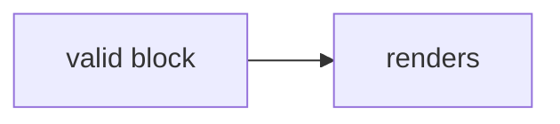

# check-mermaid self-test

Expected verdict: 2 blocks, `rendered 1/2, failed 1`.

```mermaid
flowchart LR
  A[valid block] --> B[renders]
```

```mermaid
notadiagram
  this is not a mermaid diagram type
```
